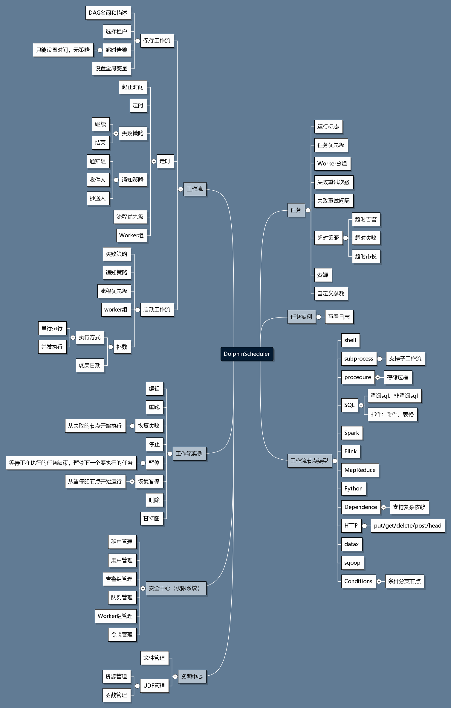

## DolphinScheduler

#### 部署
- 单机部署： [standalone](https://dolphinscheduler.apache.org/zh-cn/docs/1.3.6/user_doc/standalone-deployment.html)
- 集群部署： [cluster](https://dolphinscheduler.apache.org/zh-cn/docs/1.3.6/user_doc/cluster-deployment.html)

#### DS在工作流上具备的功能
- 失败策略：当某一个任务节点执行失败时，其他并行的任务节点需要执行的策略。
    - “继续”表示：某一任务失败后，其他任务节点正常执行；
    - “结束”表示：终止所有正在执行的任务，并终止整个流程。
- 通知策略：当流程结束，根据流程状态发送流程执行信息通知邮件，包含任何状态都不发，成功发，失败发，成功或失败都发。
- 流程优先级：流程运行的优先级
    - 分五个等级：最高（HIGHEST），高(HIGH),中（MEDIUM）,低（LOW），最低（LOWEST）。
    - 当master线程数不足时，级别高的流程在执行队列中会优先执行，相同优先级的流程按照先进先出的顺序执行。
- worker分组：该流程只能在指定的worker机器组里执行。默认是Default，可以在任一worker上执行。
- 通知组：选择通知策略||超时报警||发生容错时，会发送流程信息或邮件到通知组里的所有成员。
- 收件人：选择通知策略||超时报警||发生容错时，会发送流程信息或告警邮件到收件人列表。
- 抄送人：选择通知策略||超时报警||发生容错时，会抄送流程信息或告警邮件到抄送人列表。
- 启动参数: 在启动新的流程实例时，设置或覆盖全局参数的值。
- 补数：包括串行补数、并行补数2种模式。
    - 串行补数：指定时间范围内，从开始日期至结束日期依次执行补数，依次生成N条流程实例；
    - 并行补数：指定时间范围内，多天同时进行补数，同时生成N条流程实例。 
