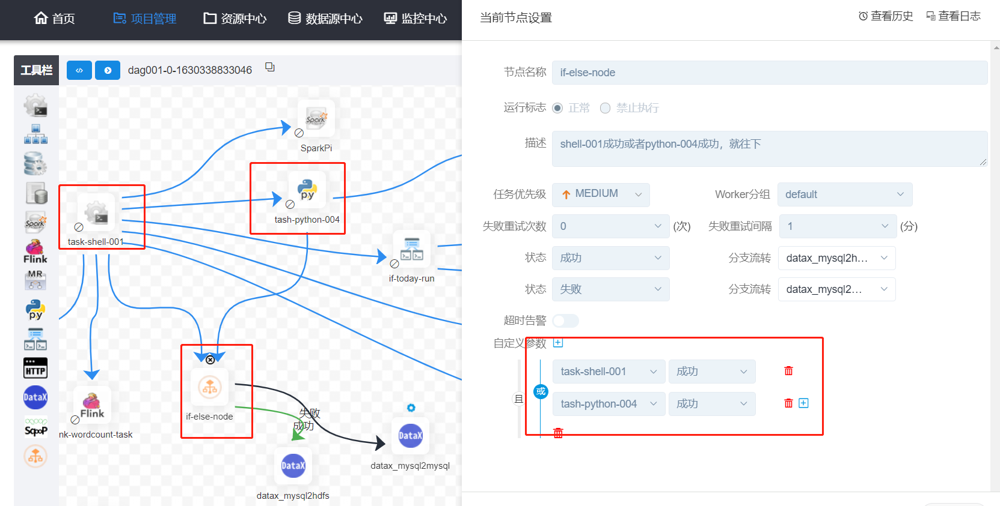

## 实践笔记

#### 1.单机部署
部署参考文档：[单机部署文档](https://dolphinscheduler.apache.org/zh-cn/docs/1.3.6/user_doc/standalone-deployment.html)
> 部署使用的相关配置文件: [单机部署配置](单机部署)

zk位置： 
zkQuorum="hadoop101:2181,hadoop102:2181,hadoop103:2181/dolphinscheduler"
实际上，不需要加上/dolphinscheduler，因为启动master的时候，会自动到zk的根目录下创建/dolphinscheduler节点。


软件包 /opt/dolphinscheduler/
安装位置 /opt/app/dolphinscheduler

hdfs的数据存放位置
resourceUploadPath="/data/dolphinscheduler"

#### 2.系统参数
- system.biz.date: 当前日期前一天，八位，如20210825
- system.biz.curdate: 当前日期，八位，20210826
- system.datetime: 当前时间，20210826220659

#### 3.通用配置

#### 4.测试任务节点
##### shell节点
```
echo "-----begin-------"
echo `date`
echo "fancy"
echo "22"
echo "biz_date: " 20210825
echo "biz_curdate" 20210826
echo "datetime" 20210826220659
echo "-----end----------"
```

##### spark
- spark的jar包需要上传到资源中心，在任务的配置界面才能选中

worker使用spark-submit的方式提交作业

##### MR
Worker使用hadoop jar的方式提交作业

##### python
Worker使用python xx 的方式提交执行

使用的解释器是conf/env/dolphinscheduler_env.sh
这个配置下的$PYTHON_HOME指向的python解释器

> 注意：若引入资源目录树下的python文件，需添加__init__.py文件

##### sql节点
有2大功能：
- 执行SQL语句：
    - 有2种类型：
        - 非查询：对应update、insert、delete操作
        - 查询：查询结果可以发邮件
    - 有3种顺序：前置sql、后置sql、主要sql
- 将sql的结果发邮件

##### 依赖(DEPENDENT)节点
依赖检查节点：提供了逻辑判断功能
- 比如检查昨天的B流程是否成功，或者C流程是否执行成功
- 例如，A流程为周报任务，B、C流程为天任务，A任务需要B、C任务在上周的每一天都执行成功
- 假如，周报A同时还需要自身在上周二执行成功

##### 存储过程节点
根据选择的数据源，执行存储过程。支持mysql、postgresql两种

##### flink节点
flink应用jar包

##### DataX节点
支持两种方式：
- sql方式，这种方式DS会自动将来源表和目标表的字段对应
- json方式

##### Conditions条件分支
自定义参数可以添加多条件的前置依赖



如上图所示：
- 自定义参数的条件成立，相当于条件节点运行成功，那么走“成功”的分支
- 自定义参数的条件不成立，那么就走“失败”的分支

#### 5.知识点
租户：linux上的用户


#### 问题：
单机部署后，如何改为集群部署？

sh install.sh 是否可以重复执行安装

工作流优先级和任务优先级的关系。
工作流worker分组与任务worker分组的关系

DAG图超时告警与任务超时告警的关系

定时配置的通知策略与启动工作流配置的通知策略有什么区别

定时和定时管理的在设计上的关系？为啥定时管理只有一组定时却要单独弄一个界面？

管理员貌似只能有一个，也就是admin，为什么要这么设计？

依赖节点的抽象，似乎非常灵活？关于调度的依赖，是否还有更灵活优雅的？

flink节点是常驻的，回到工作流一直都处于运行状态，除外，flink本身也提供了一个web界面用于管理flink应用，那么在DS中使用flink的场景是什么？
为什么要通过调度来使用呢？

DS的最佳实践应该是什么样子的？如果要精细化的管理任务，该怎么进行。
- 任务是否需要加依赖节点，是否需要条件分支节点
- 不加依赖节点的，如果失败，该停止还是继续运行？
