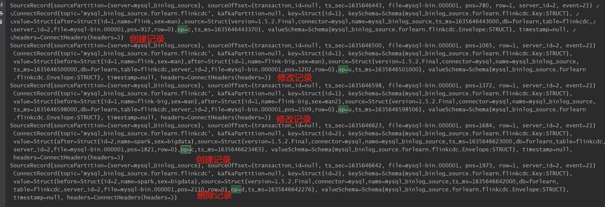

## FlinkCDC 
github地址：[flink-cdc-connectors](https://github.com/ververica/flink-cdc-connectors)

CDC是Change Data Capture（变更数据获取）的简称。
核心思想是，监测并捕获数据库 的变动（包括数据或数据表的插入 、 更新 以及 删除等），将这些变更按发生的顺序完整记录 下来，
写入到消息中间件中以供其他服务进行订阅及消费。

CDC的两种类型：
- 基于查询
- 基于binlog


flink-cdc-connectors 组件，这是一个可以直接从mysql、postgresql等数据库直接读取**全量数据**和**增量变更数据**的source组件

#### 支持的数据库版本
| Database | Version |
| --- | --- |
| MySQL | Database: 5.7, 8.0.x <br/>JDBC Driver: 8.0.16 |
| PostgreSQL | Database: 9.6, 10, 11, 12 <br/>JDBC Driver: 42.2.12|
| MongoDB | Database: 4.0, 4.2, 5.0 <br/> MongoDB Driver: 4.3.1 |
| Oracle | Database: 11, 12, 19 <br/>Oracle Driver: 19.3.0.0|

注意mysql5.6.x版本是不支持CDC的

#### cdc与flink版本的对应关系
| Flink CDC Connector Version | Flink Version |
| --- | --- |
|1.0.0 | 1.11.* |
|1.1.0 | 1.11.* |
|1.2.0 | 1.12.* |
|1.3.0 | 1.12.* |
|1.4.0 | 1.13.* |
|2.0.* | 1.13.* |

#### 使用
flink1.12.0 和 mysql-cdc1.2.0版本搭配：

pom
```
# 使用alibaba的
<dependency>
    <groupId>com.alibaba.ververica</groupId>
    <artifactId>flink-connector-mysql-cdc</artifactId>
    <version>1.2.0</version>
</dependency>
# 使用官方的
<dependency>
    <groupId>com.ververica</groupId>
    <artifactId>flink-connector-mysql-cdc</artifactId>
    <version>1.2.0</version>
</dependency>

```

创建测试表
```
CREATE TABLE `flinkcdc` (
  `id` int(11) NOT NULL,
  `name` varchar(255) DEFAULT NULL,
  `sex` varchar(255) DEFAULT NULL,
  PRIMARY KEY (`id`)
)
```

生产环境用的多的还是 INITIAL 和 LATEST_OFFSET
```
public enum StartupMode {
    INITIAL,            // 会先把表的数据用查询的方式查出来（做一个快照），然后再从binlog读取
    EARLIEST_OFFSET,    // 这种会从表最开始的位置开始读取，如果要读到完整数据，那么要求在表创建之前就已经开启binlog
    LATEST_OFFSET,      // 从最新的binlog位置读取
    SPECIFIC_OFFSETS,   // 指定offset
    TIMESTAMP;          // 指定时间戳

    private StartupMode() {
    }
}
```

读取mysql cdc的示例：[FlinkCDC.java](src/main/java/cn/fancychuan/flink/cdc/FlinkCDC.java)

结果示例：

启动命令
```
# 通过yarn-session模式
yarn-session.sh -d -jm 1024 -tm 1024 -nm flinktest 

# 提交作业
flink run -c cn.fancychuan.flink.cdc.FlinkCDC /home/appuser/forlearn/flink/flink-cdc-1.0-SNAPSHOT.jar
```


实现“断点续传”：
```
# 先手动做一次savepoint，其中9afaecdb70cf8036c353f4ff3ff5601f为job id
flink savepoint 9afaecdb70cf8036c353f4ff3ff5601f hdfs://hadoop101:8020/forlearn/flinkCDC/savepoint

# 在web界面上取消掉作业 9afaecdb70cf8036c353f4ff3ff5601f

# 重启启动作业，通过-s参数指定savepoint的路径
flink run -c cn.fancychuan.flink.cdc.FlinkCDC -s hdfs://hadoop101:8020/forlearn/flinkCDC/savepoint/savepoint-9afaec-0971be89c8f8 /home/appuser/forlearn/flink/flink-cdc-1.0-SNAPSHOT.jar
```

#### flink cdc with sql

[FlinkCDCWithSql.java](src/main/java/cn/fancychuan/flink/cdc/FlinkCDCWithSql.java)

#### Flink-CDC：DataStream和FlinkSQL的对比
优缺点| DataStream | FlinkSQL
--- | --- | ---
优点 | 多表多库 | 需要自定义反序列化器
缺点 | 不需要自定义反序列化器 | 单表查询

#### TODO：
为什么通过
```flink run -c cn.fancychuan.flink.cdc.FlinkCDCWithSql ./flink-cdc-1.0-SNAPSHOT.jar ```
是能够提交作业的，而通过界面就报错？
```
2021-11-03 00:24:45,416 WARN  org.apache.flink.client.deployment.application.DetachedApplicationRunner [] - Could not execute application: 
org.apache.flink.client.program.ProgramInvocationException: The main method caused an error: Failed to execute sql
	at org.apache.flink.client.program.PackagedProgram.callMainMethod(PackagedProgram.java:330) ~[flink-dist_2.11-1.12.0.jar:1.12.0]
	at org.apache.flink.client.program.PackagedProgram.invokeInteractiveModeForExecution(PackagedProgram.java:198) ~[flink-dist_2.11-1.12.0.jar:1.12.0]
	at org.apache.flink.client.ClientUtils.executeProgram(ClientUtils.java:114) ~[flink-dist_2.11-1.12.0.jar:1.12.0]
	at org.apache.flink.client.deployment.application.DetachedApplicationRunner.tryExecuteJobs(DetachedApplicationRunner.java:78) ~[flink-dist_2.11-1.12.0.jar:1.12.0]
	at org.apache.flink.client.deployment.application.DetachedApplicationRunner.run(DetachedApplicationRunner.java:67) ~[flink-dist_2.11-1.12.0.jar:1.12.0]
	at org.apache.flink.runtime.webmonitor.handlers.JarRunHandler.lambda$handleRequest$0(JarRunHandler.java:100) ~[flink-dist_2.11-1.12.0.jar:1.12.0]
	at java.util.concurrent.CompletableFuture$AsyncSupply.run(CompletableFuture.java:1590) [?:1.8.0_231]
	at java.util.concurrent.Executors$RunnableAdapter.call(Executors.java:511) [?:1.8.0_231]
	at java.util.concurrent.FutureTask.run(FutureTask.java:266) [?:1.8.0_231]
	at java.util.concurrent.ScheduledThreadPoolExecutor$ScheduledFutureTask.access$201(ScheduledThreadPoolExecutor.java:180) [?:1.8.0_231]
	at java.util.concurrent.ScheduledThreadPoolExecutor$ScheduledFutureTask.run(ScheduledThreadPoolExecutor.java:293) [?:1.8.0_231]
	at java.util.concurrent.ThreadPoolExecutor.runWorker(ThreadPoolExecutor.java:1149) [?:1.8.0_231]
	at java.util.concurrent.ThreadPoolExecutor$Worker.run(ThreadPoolExecutor.java:624) [?:1.8.0_231]
	at java.lang.Thread.run(Thread.java:748) [?:1.8.0_231]
Caused by: org.apache.flink.table.api.TableException: Failed to execute sql
	at org.apache.flink.table.api.internal.TableEnvironmentImpl.executeInternal(TableEnvironmentImpl.java:719) ~[flink-table-blink_2.11-1.12.0.jar:1.12.0]
	at org.apache.flink.table.api.internal.TableEnvironmentImpl.executeOperation(TableEnvironmentImpl.java:1067) ~[flink-table-blink_2.11-1.12.0.jar:1.12.0]
	at org.apache.flink.table.api.internal.TableEnvironmentImpl.executeSql(TableEnvironmentImpl.java:665) ~[flink-table-blink_2.11-1.12.0.jar:1.12.0]
	at cn.fancychuan.flink.cdc.FlinkCDCWithSql.main(FlinkCDCWithSql.java:32) ~[?:?]
	at sun.reflect.NativeMethodAccessorImpl.invoke0(Native Method) ~[?:1.8.0_231]
	at sun.reflect.NativeMethodAccessorImpl.invoke(NativeMethodAccessorImpl.java:62) ~[?:1.8.0_231]
	at sun.reflect.DelegatingMethodAccessorImpl.invoke(DelegatingMethodAccessorImpl.java:43) ~[?:1.8.0_231]
	at java.lang.reflect.Method.invoke(Method.java:498) ~[?:1.8.0_231]
	at org.apache.flink.client.program.PackagedProgram.callMainMethod(PackagedProgram.java:316) ~[flink-dist_2.11-1.12.0.jar:1.12.0]
	... 13 more
Caused by: java.lang.IllegalArgumentException: Job client must be a CoordinationRequestGateway. This is a bug.
	at org.apache.flink.util.Preconditions.checkArgument(Preconditions.java:142) ~[flink-dist_2.11-1.12.0.jar:1.12.0]
	at org.apache.flink.streaming.api.operators.collect.CollectResultFetcher.setJobClient(CollectResultFetcher.java:95) ~[flink-dist_2.11-1.12.0.jar:1.12.0]
	at org.apache.flink.streaming.api.operators.collect.CollectResultIterator.setJobClient(CollectResultIterator.java:98) ~[flink-dist_2.11-1.12.0.jar:1.12.0]
	at org.apache.flink.table.planner.sinks.SelectTableSinkBase$1.setJobClient(SelectTableSinkBase.java:93) ~[flink-table-blink_2.11-1.12.0.jar:1.12.0]
	at org.apache.flink.table.api.internal.TableEnvironmentImpl.executeInternal(TableEnvironmentImpl.java:709) ~[flink-table-blink_2.11-1.12.0.jar:1.12.0]
	at org.apache.flink.table.api.internal.TableEnvironmentImpl.executeOperation(TableEnvironmentImpl.java:1067) ~[flink-table-blink_2.11-1.12.0.jar:1.12.0]
	at org.apache.flink.table.api.internal.TableEnvironmentImpl.executeSql(TableEnvironmentImpl.java:665) ~[flink-table-blink_2.11-1.12.0.jar:1.12.0]
	at cn.fancychuan.flink.cdc.FlinkCDCWithSql.main(FlinkCDCWithSql.java:32) ~[?:?]
	at sun.reflect.NativeMethodAccessorImpl.invoke0(Native Method) ~[?:1.8.0_231]
	at sun.reflect.NativeMethodAccessorImpl.invoke(NativeMethodAccessorImpl.java:62) ~[?:1.8.0_231]
	at sun.reflect.DelegatingMethodAccessorImpl.invoke(DelegatingMethodAccessorImpl.java:43) ~[?:1.8.0_231]
	at java.lang.reflect.Method.invoke(Method.java:498) ~[?:1.8.0_231]
	at org.apache.flink.client.program.PackagedProgram.callMainMethod(PackagedProgram.java:316) ~[flink-dist_2.11-1.12.0.jar:1.12.0]
	... 13 more
2021-11-03 00:24:45,418 ERROR org.apache.flink.runtime.webmonitor.handlers.JarRunHandler   [] - Exception occurred in REST handler: Could not execute application.
```