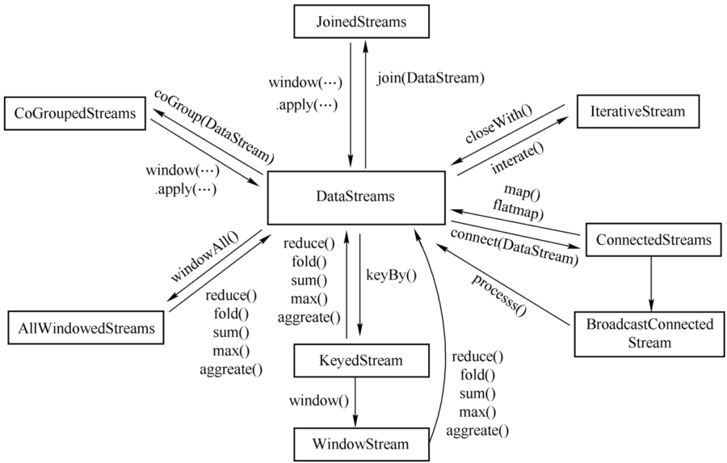

## Flink基础知识与API

Flink的重要特点；
- 事件驱动型（event-driven）:根据到来的事件触发计算、状态更新或其他外部动作，比如Kafka
- 流与批的世界观
    - Flink世界观中一切都是由流组成的，离线数据是有界限的流，实时数据是一个没有界限的流【有界流、无界流】
    - 而在Spark中，一切都是批次组成的，离线数据是大批次，实时数据是由一个一个无限的小批次组成的
    - 无界数据流：数据流有一个开始但是灭有结束
    - 有界数据流：数据流有明确定义的开始和结束
- 分层API
    - 高级语言：SQL
    - 声明式DSL语法：Table API
    - 核心API：DataStream/DataSet API 
    - 低级API：Stateful Stream Processing
- 支持有状态计算：flink1.4以后也支持中间结果缓存，相当于checkpoint操作
- 支持exactly-once语义：有且仅执行一次
- 支持事件时间（EventTime）

流处理API：environment -> source -> transform -> sink

### 1. Environment
- getExecutionEnvironment
    - 创建一个执行环境，表示当前执行程序的上下文
        - 程序独立调用，此方法返回本地执行环境
        - 程序提交到集群，此方法返回集群的执行环境
```
val env: ExecutionEnvironment = ExecutionEnvironment.getExecutionEnvironment
val env = StreamExecutionEnvironment.getExecutionEnvironment
```
- createLocalEnvironment：返回本地执行环境，需要在调用时指定默认的并行度
- createRemoteEnvironment
```
val env = StreamExecutionEnvironment.createLocalEnvironment(1)
val env = ExecutionEnvironment.createRemoteEnvironment("jobmanage-hostname", 6123,"YOURPATH//wordcount.jar")
```

### 2. DataSource
- 基于文本：readTextFile
- 基于Socket：socketTextStream
- 基于集合：fromCollection
- 自定义输入：addSource
    - FlinkKafkaConsumer011 从kafka队列中消费

代码参见：[SourceApp.scala](src/main/scala/cn/fancychuan/scala/SourceApp.scala)

### 3. Transform算子
在flink中，source之后，sink之前的中间所有过程，都可以认为是转换算子，这个跟spark中的转换算子不是一个概念。

基本转换算子：map, flatMap, filter

分区汇总转换算子
- keyBy
    - DataStream → KeyedStream：逻辑地将一个流拆分成不相交的分区，每个分区包含具有相同key的元素，在内部以hash的形式实现的
    - 基于key的hash code重分区
    - 同一个key
- max/maxBy, min/minBy, sum
- reduce

多流转换算子
- split, select
- connect, CoMap, CoFlatMap
- union

整个转换算子涉及到的Stream类型


### 4. 支持的数据类型
- 基本的数据类型
- java和Scala元组（tuple）
- Scala样例类
- Java简单对象（POJO）
- 其它（Arrays, Lists, Maps, Enums, 等等）

### 5. 实现UDF-更细粒度的控制流
#### 5.1 函数类
Flink暴露了所有UDF函数的接口，实现方式为接口或者抽象类。比如MapFunction, FilterFunction, ProcessFunction

DataStream的其他函数
- broadcast
- shuffle：将数据均匀分发。注意，不是完全平均的分发，而是随机的打散
- forward
- rebalance
- rescale
- global：所有分区合并到一个
- iterate

#### 5.2 匿名函数类
#### 5.3 富函数类
“富函数”是DataStream API提供的一个函数类的接口，所有Flink函数类都有其Rich版本。它与常规函数的不同在于，可以获取运行环境的上下文，并拥有一些生命周期方法，所以可以实现更复杂的功能

比如RichMapFunction， RichFlatMapFunction

Rich Function有一个生命周期的概念，典型的方法有：
- open()方法是rich function的初始化方法。一个算子（比如map）被调用之前open()会被调用
- close()方法是生命周期中的最后一个调用的方法，做一些清理工作
- getRuntimeContext()方法提供了函数的RuntimeContext的一些信息，例如函数执行的并行度，任务的名字，以及state状态

### 6.Sink
FlinkKafkaProducer011


#### 7.窗口Window
Window是一种切割无线数据为有限块进行处理的手段。Window是无限处理流处理的核心，将一个无限的stream拆成有限大小的buckets桶，可以在这些桶上做计算操作。

##### 7.1 Window类型
- TimeWindow：按时间生成Window
    - 滚动窗口
        - 将数据依据固定的窗口长度对数据进行切分
        - 特点：时间对齐，窗口长度固定，没有重叠
        - 适用场景：BI统计（做每个时间段的聚合计算）
    - 滑动窗口
        - 是固定窗口的更广义的一种形式
        - 由固定窗口长度和滑动间隔组成（例如10分钟窗口，5分钟滑动）
        - 特点：时间对齐，窗口长度固定，可以有重叠
        - 适合场景：对最近一段时间内的事件做统计（求某接口近5min的失败率来决定是否告警）
    - 会话窗口
        - 指定时间长度timeout间隙，也就是一段时间没有收到新数据就会生成新的窗口，类似于web应用的session
        - 特点；时间无对齐（session间隔定义了非活跃周期的长度）
> Flink默认的时间窗口是根据process time进行窗口划分的，将Flink获取到的数据根据进入Flink的时间划分到不同的窗口

- CountWindow：按指定数据条数生成一个window，条数达到就触发计算，与时间无关
    - 滚动计数窗口
    - 滑动计数窗口
> 注意：countWindow的window_size指的是相同key的元素的个数，而不是输入的所有元素的总数

#### 7.2 Window API
window()方法
- 用.window()来定义一个窗口
- 需要在keyBy之后才能使用
- Flink还提供了更加简单的timeWindow()和countWindow()方法


窗口分配器（Window assigner）
- window()方法接收的输入参数是一个WindowAssigner
- WindowAssigner负责将每条输入的数据分发到正确的window中
- Flink中提供的通用的WindowAssigner
    - 滚动窗口 tumbling window
        - window(TumblingProcessingTimeWindows.of(Time.seconds(15)))
        - timeWindow(Time.seconds(10))
    - 滑动窗口 sliding window
        - timeWindow(Time.seconds(10), Time.seconds(5))
    - 会话窗口 session window
        - .window(EventTimeSessionWindows.withGap(Time.seconds(10)))
    - 全局窗口 global window
    
    
窗口函数：对窗口收集的数据所做的计算操作
- 增量聚合函数
    - 每条数据到来就进行计算，保持一个简单的状态
    - ReduceFunction, AggregateFunction
- 全窗口函数
    - 先把窗口所有数据收集起来，等到计算的时候便利所有数据
    - ProcessWindowFunction, WindowFunction
    
其他可选API
- trigger() 触发器    
    - 定义window什么时候关闭，触发计算并输出结果
- evictor() 移除器
- allowedLateness() 允许处理迟到的数据
- sideOutputLateData() 将迟到的数据放入侧输出流
- getSideOutput() 获取侧输出流

### 8.ProcessFunction API （底层API）
DataStream提供了一系列底层的转换算子，可以**时间戳、Watermark以及注册定时时间**，还可以输出**特定的一些事件**，普通的转换算子是无法做到的。
> Flink SQL就是使用ProcessFunction实现的

- ProcessFunction
- KeyedProcessFunction
- CoProcessFunction
- ProcessJoinFunction
- BroadcastProcessFunction
- KeyedBroadcastProcessFunction
- ProcessWindowFunction
- ProcessAllWindowFunction

#### 8.1 TimeService和定时器（Timers)
TimerService对象拥有以下方法:
- currentProcessingTime(): Long 返回当前处理时间
- currentWatermark(): Long 返回当前watermark的时间戳
- registerProcessingTimeTimer(timestamp: Long): Unit 会注册当前key的processing time的定时器。当processing time到达定时时间时，触发timer。
- registerEventTimeTimer(timestamp: Long): Unit 会注册当前key的event time 定时器。当水位线大于等于定时器注册的时间时，触发定时器执行回调函数。
- deleteProcessingTimeTimer(timestamp: Long): Unit 删除之前注册处理时间定时器。如果没有这个时间戳的定时器，则不执行。
- deleteEventTimeTimer(timestamp: Long): Unit 删除之前注册的事件时间定时器，如果没有此时间戳的定时器，则不执行

定时器
- 定时器注册的类型 跟配置的时间语义没关系
- 定时器timer只能在keyed streams上面使用

参见示例：
- 使用说明 [MyKeyedProcessFunction](src/main/java/cn/fancychuan/process/MyKeyedProcessFunction.java)
- 案例，连续5s温度上升：[TempDownKeyedProcesssFunc](src/main/java/cn/fancychuan/process/TempDownKeyedProcesssFunc.java)

#### 8.2 侧输出流（SideOutput）
除了split算子，可以将一条流分成多条流，这些流的数据类型也都相同。
process function的side outputs功能可以产生多条流，并且这些流的数据类型可以不一样。
一个side output可以定义为OutputTag[X]对象，X是输出流的数据类型。
process function可以通过Context对象发送一个事件到一个或者多个side outputs。

使用示例：[SideOutputProcessFunction](src/main/java/cn/fancychuan/process/SideOutputProcessFunction.java)

#### 8.3 CoProcessFunction
注意案例 [OrderPayStatApp.java](src/main/java/cn/fancychuan/shopapp/OrderPayStatApp.java)
中对两条流的数据，要考虑多并行度的影响，一般需要先使用keyBy()