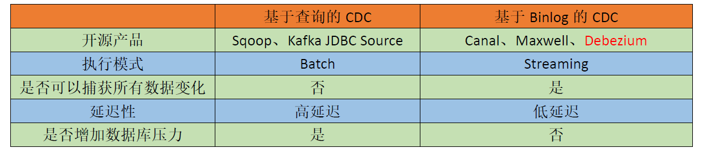

## FlinkCDC 
CDC是Change Data Capture（变更数据获取）的简称
核心思想是，监测并捕获数据库 的变动（包括数据或数据表的插入 、 更新 以及 删除等），将这些变更按发生的顺序完整记录 下来，
写入到消息中间件中以供其他服务进行订阅及消费。

CDC的种类：
- 基于查询
- 基于binlog

flink-cdc-connectors 组件，这是一个可以直接从mysql、postgresql等数据库直接读取**全量数据**和**增量变更数据**的source组件

