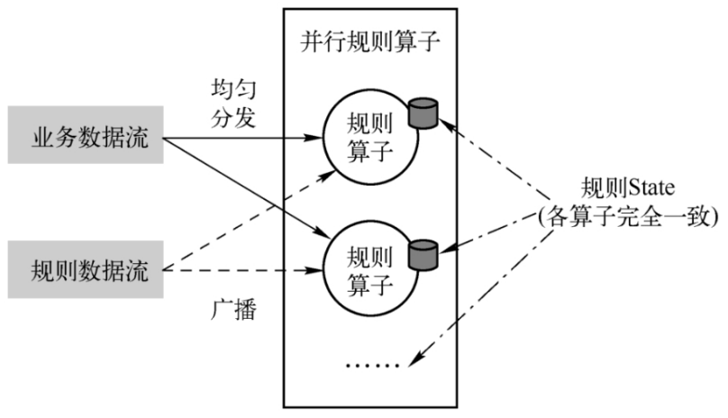

# Flink内核原理与实现

## 状态原理

要做到比较好的State管理，需要考虑以下几点内容
- **（1）状态数据的存储和访问。**
在Task内部，如何高效地保存状态数据和使用状态数据。
- **（2）状态数据的备份和恢复。**
作业失败是无法避免的，那么就要思考如何高效地将状态数据保存下来，避免状态备份降低集群的吞吐量 ，
并且在Failover的时候恢复作业到失败前的状态。
- **（3）状态数据的划分和动态扩容。**
作业在集群内并行执行，那么就要思考对于作业的Task而言如何
使用同一的方式对状态数据进行切分，在作业修改并行度导致Task数量改变的时候，如何确保正确地恢复到Task。
- **（4）状态数据的清理。**
状态的保存和使用都是有成本的，而且状态并不是永久有效的，所以对于过期的状态进行清理就非常有必要。

按照由Flink管理还是用户自行管理，状态可以分为原始状态（Raw State）和托管状态（ManagedState）。
- 原始状态：用户自定义的State，flink做快照的时候state为一个整体，使用byte数组来读写状态内容
- 托管状态：flink框架提供管理的State，比如ValueState、ListState等

状态的描述：StateDescriptor

#### 广播状态
广播状态在Flink中叫作BroadcastState，在广播状态模式中使用。
所谓广播状态模式，就是来自一个流的数据需要被广播到所有下游任务，在算子本地存储，在处理另一个流的时候依赖于广播的数据。

如图示例：
- 规则数据流是广播数据流，规则算子将这个广播数据流缓存在本地内存。可以满足实时性、规则更新的要求。
- 业务数据流是普通数据流（主流），记录到来之时，每次都能使用到最新的规则进行计算

广播State必须是MapState类型，需要使用广播函数进行处理

#### 状态接口
