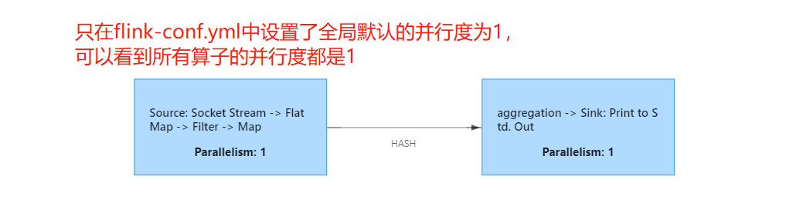
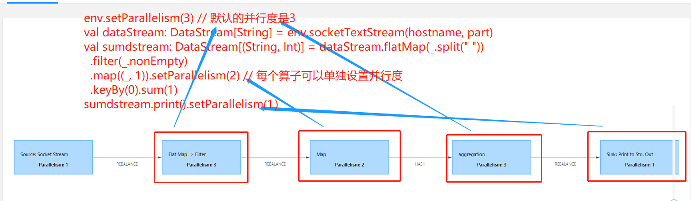
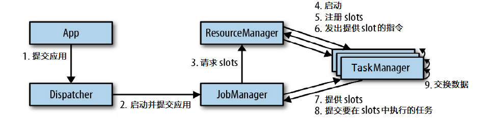
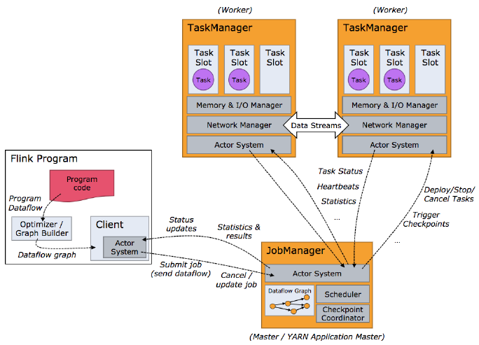
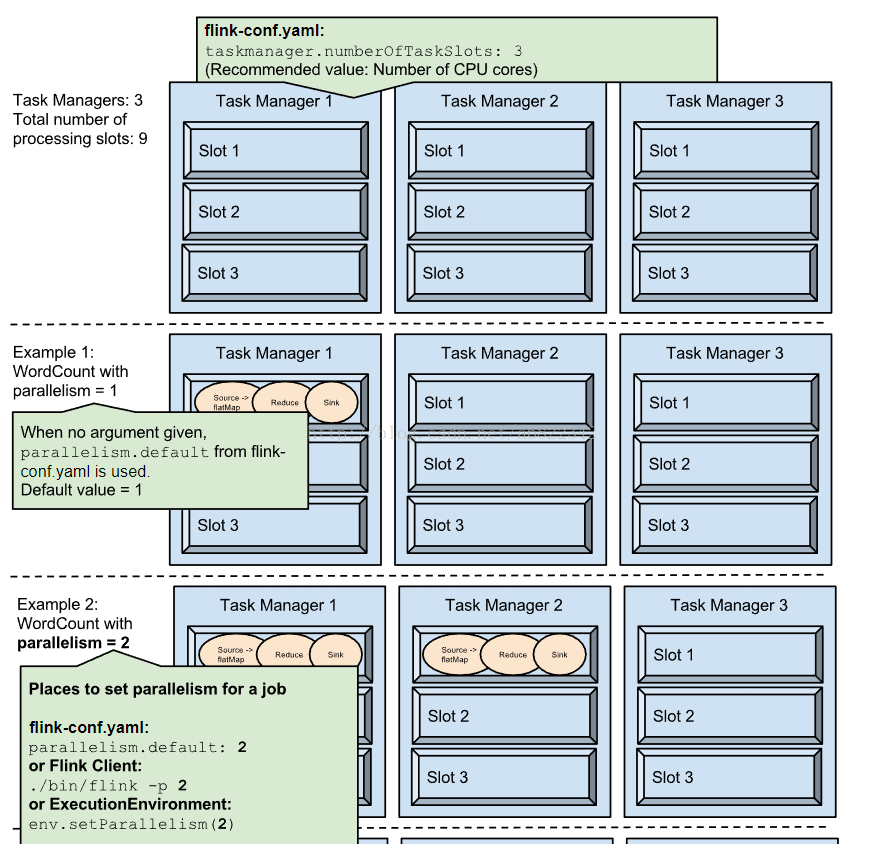
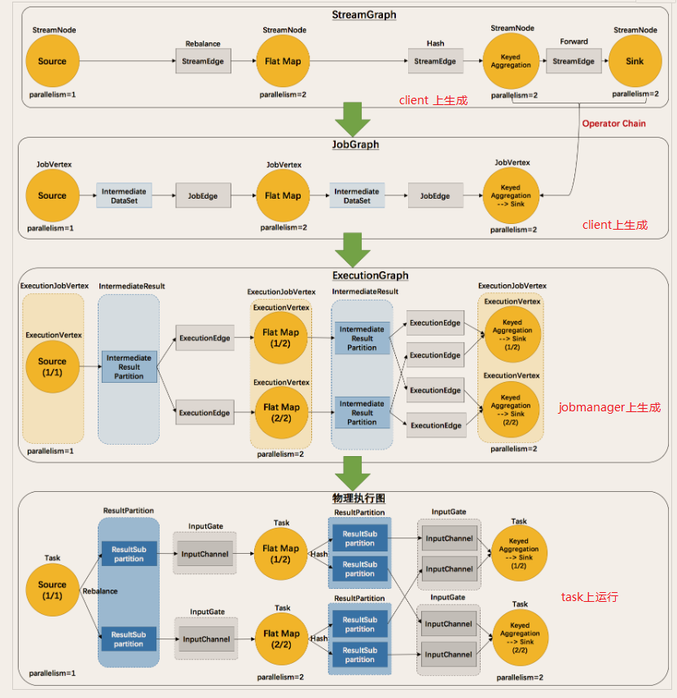
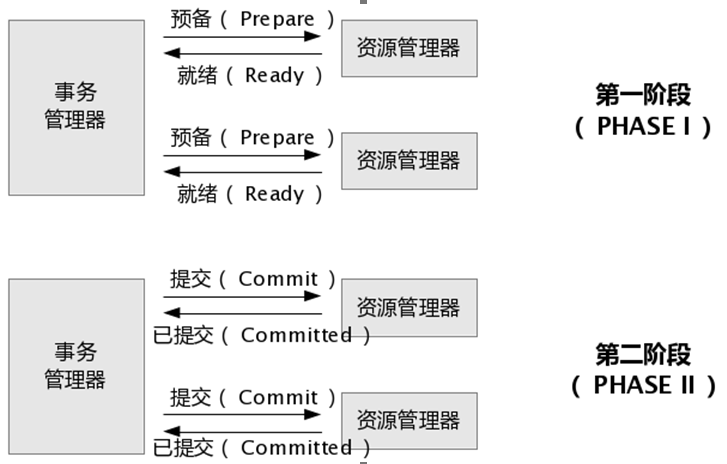
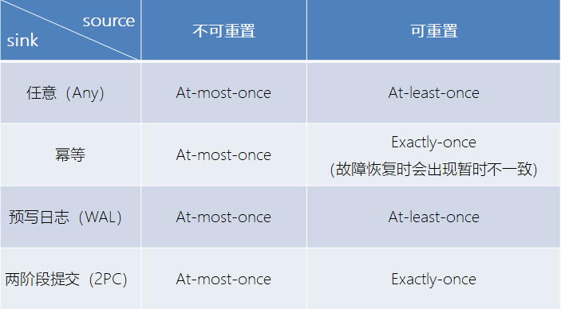

## Flink
Flink项目的理念是：“Apache Flink是为分布式、高性能、随时可用以及准确的流处理应用程序打造的开源流处理框架”

Apache Flink 是一个框架和分布式处理引擎，用于在无边界和有边界数据流上进行有状态的计算。Flink 能在所有常见集群环境中运行，并能以内存速度和任意规模进行计算
- 有界流
- 无界流

Flink的应用场景
- 实时推荐系统
- 复杂事件处理：比如车载传感器等实时故障检测
- 实时欺诈检测
- 实时数仓与ETL
- 流数据分析
- 实时报表分析

Flink的特点和优势
- 同时支持高吞吐、低延迟、高性能
    - Storm低吞吐
    - Spark Streaming也是高吞吐
- 支持事件事件（Event Time）概念
    - 目前大多数框架窗口计算使用的都是系统事件（ProcessTime）
- 支持有状态计算
    - 指算子的中间结果存在内存或文件系统中，下一个事件到来的时候继续计算
    - spark默认是无状态的，而flink默认是有状态的
- 支持高度灵活的窗口操作
    - Flink将窗口划分为基于Time、Count、Session以及Data-driven等类型的窗口操作
- 基于轻量级分布式快照（checkpoint）事件的容错
- 基于JVM实现独立的内存管理
- 保存点（Save Point）
    - 默认不开启，需要手动开启
    - 一般用于升级，checkpoint一般用于容错

流式计算框架的对比
 
### WordCount应用
- 批处理的方式实现：[DataSetWcApp.scala](src/main/scala/cn/fancychuan/scala/quickstart/DataSetWcApp.scala)
- 流处理的方式实现：[DataStreamWcApp.scala](src/main/scala/cn/fancychuan/scala/quickstart/DataStreamWcApp.scala)

作业提交方式：
1.通过web界面提交
2.通过flink命令
```
bin/flink run -c cn.fancychuan.scala.quickstart.DataStreamWcApp \
-p 2 /home/appuser/forlearn/flink/flink-1.0-SNAPSHOT.jar \
--host hadoop101 --port 7777
```

不同并行度设置对作业的影响：
- 只使用全局设置的默认并行度

- 既设计作业默认并行度，又给算子单独设置

- 只设置作业默认的并行度


### 4运行时架构
#### 4.1 Flink运行时的组件
- 作业管理器（JobManager）
    - 控制一个应用程序执行的主进程
    - 应用程序包括：作业图（JobGraph）、逻辑数据流图（logical dataflow graph）和打包了所有的类、库和其它资源的JAR包
    - 会把一个逻辑数据流图转成物理层面的数据流图，叫“执行图”（ExecutionGraph），包含了所有可以并发执行的任务
    - 向ResourceManager申请资源（也就是插槽slot）
    - 获得足够的资源后，就会将执行图分发到真正运行task的TaskManager上
    - 负责所有需要中央协调的操作，比如checkpoints的协调
- 资源管理器（ResourceManager）
    -主要负责管理TaskManager上的slot，TaskManger插槽是Flink中定义的处理资源单元
    - 负责终止空闲的TaskManager，释放计算资源
    - 如果ResourceManager没有足够的插槽来满足JobManager的请求，它还可以向资源提供平台发起会话，以提供启动TaskManager进程的容器【啥意思？】
- 任务管理器（TaskManager）
    - Flink中的工作进程
    - 插槽的数量限制了TaskManager能够执行的任务数量
    - 启动之后，TaskManager会向资源管理器注册它的插槽
    - 收到资源管理器的指令后，TaskManager就会将一个或者多个插槽提供给JobManager调用
    - 执行过程中，一个TaskManager可以跟其它运行同一应用程序的TaskManager交换数据
- 分发器（Dispatcher）
    - 可以跨作业运行，它为应用提交提供了REST接口
    - 当一个应用被提交执行时，分发器就会启动并将应用移交给一个JobManager
    - Dispatcher在架构中可能并不是必需的

#### 4.2 任务作业提交流程
任务提交和组件交互流程



Yarn模式任务提交流程


#### 4.3 任务调度原理

> 客户端不是运行时的一部分，也不是程序执行的一部分，它用于准备并发送dataflow(JobGraph)给Master(JobManager)，然后，客户端断开连接或者维持连接以等待接收计算结果
- 4.3.1 TaskManger与Slots
    - TaskManager是一个JVM进程，可能会在独立的线程上执行一个或多个subtask
    - worker（TaskManager）通过task slot来进行控制（一个worker至少有一个task slot）
    - 每个task slot表示TaskManager拥有资源的一个固定大小的子集，比如一个TaskManager上有3个slot，那么TaskManager会将其管理的内存分成三份给各个slot
    - slot和slot之间的内容是彼此隔离的，但CPU是共享的
    - 一个TaskManager多个slot意味着更多的subtask可以共享同一个JVM，在同一个JVM进程中的task将共享TCP连接（基于多路复用）和心跳消息
    - 默认情况下，flink允许子任务共享slot，即使它们是不同任务的子任务（前提是它们来自同一个job）。由此一个slot是可以保存作业的整个管道的
    - Task Slot是静态的概念，是指TaskManager具有的并发执行能力，并行度parallelism是动态概念，即TaskManager运行程序时实际使用的并发能力
    - 一个流处理程序需要的slot数量，其实就是所有任务中最大的那个并行度
    
> 子任务共享Slot

> 并行度与slot的使用情况示例


- 4.3.2 程序与数据流（DataFlow）
    - 程序由三部分组成：Source（读数据）、Transformation（用算子加工）和Sink（输出）
    - 程序会被映射成“逻辑数据流”（dataflows）
    - 每一个dataflow以一个或多个sources开始以一个或多个sinks结束。dataflow类似于任意的有向无环图（DAG）

- 4.3.3 执行图（ExecutionGraph）
    - 执行图可以分成四层：StreamGraph -> JobGraph -> ExecutionGraph -> 物理执行图
        - StreamGraph：由Flink程序直接映射成的数据流图，也叫逻辑流图，表示的是计算逻辑的高级视图，能体现程序的拓扑结构
        - JobGraph：StreamGraph经过优化后生成了 JobGraph，提交给 JobManager 的数据结构
            - 将多个符合条件的节点 chain 在一起作为一个节点，减少数据在节点之间流动所需要的序列化/反序列化/传输消耗
        - ExecutionGraph：根据 JobGraph 生成ExecutionGraph。ExecutionGraph是JobGraph的并行化版本，是调度层最核心的数据结构
        - 物理执行图：JobManager 根据 ExecutionGraph 对 Job 进行调度后，在各个TaskManager 上部署 Task 后形成的“图”，并不是一个具体的数据结构

        

- 4.4.4 并行度（Parallelism）
    - 一个流有一个或多个分区，一个算子可以包含一个或多个subtask，这些子任务可以在不同线程、不同物理机或不同容器中互不依赖执行
    - 一个特定算子的子任务的个数，成为并行度
    - 一般的，一个程序的并行度可以认为是其所有算子中最大的并行度（不同算子可以有不同的并行度）
    - stream在算子的的传输形式有两种：
        - one-to-one(forwarding)：一对一，比如map、flatMap，类似于spark中的窄依赖
        - Redistributing：分区会发生变化，例如，keyBy() 基于hashCode重分区、broadcast和rebalance会随机重新分区，这些算子都会引起redistribute过程，类似于shuffle操作，宽依赖
- 4.4.5 任务链（Operator Chains）
    - 将算子链接成task是非常有效的优化：它能减少线程之间的切换和基于缓存区的数据交换，在减少时延的同时提升吞吐量
    - 要求：相同并行度的one to one操作
.png)

> 并行：
> 数据并行 —— 同一个任务，不同的并行子任务，同时处理不同的数据
> 任务并行 —— 同一时间，不同的slot在执行不同的任务


### 5.时间语义与watermark
窗口Window相关知识查看[Flink基础知识与API.md](./Flink基础知识与API.md)
#### 5.1时间语义
- Event Time：事件创建的时间
- Ingestion Time：数据进入Flink的时间
- Process Time： 执行操作算子的本地时间，与机器相关
> Flink默认是使用process time时间

EventTime的引入
```
env.setStreamTimeCharacteristic(TimeCharacteristic.EventTime)
```

#### 5.2 Watermark
> 乱序：Flink接收到事件的先后顺序不是严格按照Event Time顺序排列的。此时只根据EventTime无法明确数据是否到位，又不能无限期的等下去。因此需要有Watermark这样的一个机制，等待一个特定的时间后触发Window去计算
- Watermark是一种衡量event time进展的机制，可以理解为一个延迟触发机制，
  已到达的数据中最大的maxEventTime减去允许的延迟时间等于窗口的停止时间，则触发窗口的计算，
  也就是说window的执行也是由Watermark触发
- 数据流中的Watermark用于表示timestamp小于Watermark的数据都已经到达
- Watermark是基于数据携带的时间戳生产的，如果运行过程中无法获取新的数据，那么没有被触发的窗口将永远不会被触发
- Watermark用来让程序自己平衡延迟和结果正确性，主要用于处理乱序事件，通常用watermark机制结合window实现


watermark的特点：
- watermark是一条特殊的数据记录（继承StreamElement）【相当于只是时间戳】
- watermark必须是单调递增，以确保任务的EventTime时钟在向前推进
- watermark与数据的时间戳相关

watermark的传递
- 从上游到下游，需要将watermark广播到下游
- 不同分区来的watermark，会存到在当前分区的Partition WM中，并从中选取最小的watermark广播到下游分区
- 如果新来watermark后，当前分区的最小watermark不变，那么不会向下游广播watermark

watermark的设定
- 设置的延迟太久，则结果产出慢，解决办法是在水位线到达之前输出一个近似结果
- 如果watermark到达得太早，则可能受到错位的结果，不过Flink处理迟到数据的机制可以解决这个问题

##### Watermark的引入
```
dataStream.assignTimestampAndWatermarks(new MyAssigner())
```
MyAssigner有两种类型，都继承自TimestampAssigner：
> TimestampAssigner定义了抽取时间戳以及生成watermark的方法
- AssignerWithPeriodicWatermarks
    - 周期性生成watermark，默认周期是200毫秒，修改生成周期的方法：env.getConfig.setAutoWatermarkInterval(100);
    - 自定义实现：[MyPeriodicAssigner.java](src/main/java/cn/fancychuan/assigner/MyPeriodicAssigner.java)
    - 使用场景：在流数据密集，周期性生成
    - 两种特殊场景：
        - 事先知道数据流是单调递增的，没有乱序，则可以使用 AscendingTimestampExtractor，这个类直接使用数据的时间戳生产Watermark
        - 能大致估摸出数据流中的最大延迟时间，则可以使用 BoundedOutOfOrdernessTimestampExtractor
        - 这两种情况参考 [JavaWatermarkApp.java](src/main/java/cn/fancychuan/JavaWatermarkApp.java)
- AssignerWithPunctuatedWatermarks
    - 断点式生成watermark，可以根据每条数据的情况来选择是否生成Watermark，处理方法是：checkAndGetNextWatermark
    - 自定义时间：[MyPunctuatedAssigner.java](src/main/java/cn/fancychuan/assigner/MyPunctuatedAssigner.java)
    - 使用场景：流数据稀疏
    

##### 示例1：Watermark设置延迟为2，滚动窗口大小为5
参见代码：[JavaWatermarkApp.java](src/main/java/cn/fancychuan/JavaWatermarkApp.java)
```
sensor_6,1547718199,35.8    # [195,200) 199存入这个窗口
sensor_6,1547718202,15.4    # 202存入[200,205)这个窗口，同时watermark(200)触发了上个窗口[195,200)的计算
sensor_6,1547718203,13.4    # 203存入[200,205)这个窗口
sensor_6,1547718204,14.4    # 204存入[200,205)这个窗口
sensor_6,1547718205,15.4    # 205存入[205,210)这个窗口，这个时候不会有任何计算
sensor_6,1547718206,16.4
sensor_6,1547718207,16.4    # 207存入[205,210)这个窗口，同时watermark(205)触发了[200,205)的计算
```

Window的起始位置计算逻辑：org.apache.flink.streaming.api.windowing.windows.TimeWindow.getWindowStartWithOffset
```
public static long getWindowStartWithOffset(long timestamp, long offset, long windowSize) {
	return timestamp - (timestamp - offset + windowSize) % windowSize;
}
```

##### 示例2：Watermark设置延迟为2，滚动窗口大小为5，允许迟到数据1分钟内，并开启兜底方案
```
// 设置允许的迟到时间。这里例子中，每5秒一个窗口，1分钟之内这个窗口都不会关闭，每来一个数据更新一次结果
.allowedLateness(Time.minutes(1))
// 兜底方案，将超过1分钟都没有到达的数据放到侧输出流中
.sideOutputLateData(outputTag)
```
详细过程如下
```
sensor_1,1547718211,36.1    # 211存入[210,215)窗口，不会触发计算
sensor_1,1547718215,36.5    # 215存入[215,220)窗口，不会触发计算
sensor_1,1547718214,37.5    # 214存入[210,215)窗口，不会触发计算
sensor_1,1547718217,36.5    # 215存入[215,220)窗口，触发[200,215)这个窗口计算
sensor_1,1547718212,32.2    # 212存入[210,215)窗口，不会触发计算
sensor_1,1547718218,36.5    # 218存入[215,220)窗口，不会触发计算
sensor_1,1547718222,31.1    # 222存入[220,225)窗口，触发[215,220)这个窗口计算
sensor_1,1547718280,30.5    # 280存入[280,285)窗口，触发[220,225)这个窗口计算（在275之前的所有窗口都会被触发，运维Watermark已经到了278）
sensor_1,1547718212,32.2    # 212原本属于[210,215)，但现在Watermark已经到了278，超过了60s，属于迟到数据，按迟到机制处理
sensor_1,1547718288,33.8    # 288存入[285,290)窗口，触发[280,285)这个窗口计算
sensor_1,1547718228,32.2    # 228存入[225,230)窗口，因为Watermark=278还没到这个窗口所允许的最大迟到时间，也就是290，因此228直接触发了[225,230)这个窗口的计算
sensor_1,1547718225,13.2    # Watermark=278，所关闭的窗口为[210,215)，因此225还是触发了[225,230)这个窗口的计算
sensor_1,1547718292,33.8    # 292存入[290,292)窗口，Watermark=290，因此关闭了[225,230)这个窗口
sensor_1,1547718225,13.2    # 再来一个225的时候，[225,230)这个窗口已经关闭，因此，225迟到了
```


### 6. 状态编程与容错机制
#### 6.1 概述
流式计算：
- 无状态：观察每个独立事件，根据最后一个事件输出结果。例如水位超过指定高度就告警
- 有状态：基于多个事件输出结果。例如：
  - 计算过去一小时的平均水位
  - 一分钟内收到两个相差20cm以上的水位差读书，则告警
  - 流与流之间的所有关联操作，以及流与静态表或动态表之间的关联操作，都是有状态的

#### 6.2 有状态的算子
有两种类型的状态：
- 算子状态(operator state)：作用范围限定为算子任务
  - 状态对于同一任务而言是共享的，所有数据都可以访问到相同的状态
  - 算子状态不能由相同或不同算子的**另一个任务**访问
  - 算子状态有3种数据结构：
    - 列表状态
    - 联合列表状态
    - 广播状态
- 键控状态(keyed state)：根据输入数据流中定义的键(key)来维护和访问的
  - 具有相同key的所有数据都会访问相同的状态
  - 只能用于KeyedStream
  - Flink为每个键值维护一个状态实例，相当于是一个分布式的key-value map数据结构

状态后端(state backend)：一个可插入的组件，决定着状态的存储、访问以及维护
> 每传入一条数据，有状态的算子都会读取和更新状态，为了保证低延迟的快速访问，每个并行任务会在本地维护其状态
- 职责：
  - 本地的状态管理
  - 将checkpoint状态写入远程存储
- 分类：
  - MemoryStateBackend：内存级的状态后端
    - 将键控状态存储在TaskManager的JVM堆上
    - 将checkpoint存储在JobManager的内存中
    - 适用场景：
      - 本地开发或调试，这个时候作业的状态有限
      - MemoryStateBackend最适合具有小状态大小的用例和有状态流处理应用程序，例如仅包含一次记录功能（Map，FlatMap或Filter）的作业或使用Kafkaconsumer
  - FsStateBackend
    - 将checkpoint存到远程的持久化文件系统（FileSystem）上
    - 本地状态，跟MemoryStateBackend一样，存在TaskManager的JVM堆上
    - 适用场景：适合处理大状态，长窗口或大键值状态的流处理作业，适合每个高可用设置
  - RocksDBStateBackend：将所有状态序列化后存入本地的RocksDB中存储（Flink不直接支持，需要加入依赖）
    - 适用场景同FsStateBackend
    - 是目前唯一可以用于支持有状态流处理程序的增量检查点的状态后端

#### 6.3 状态一致性
一致性级别：
- at-most-once
- at-least-once
- exactly-once

端到端(end-to-end)状态一致性
> 意味着结果的正确性贯穿了整个流处理应用的始终，整个端到端的一致性级别取决于所有组件中一致性最弱的组件
- source端：需要外部源可重设数据的读取位置
- flink内部：依赖checkpoint
- sink端：需要保证从故障恢复时，数据不会重复写入外部系统。而对于sink端，又有两种具体的实现方式：
  - 幂等（Idempotent）写入：所谓幂等操作，是说一个操作，可以重复执行很多次，但只导致一次结果更改
  - 事务性（Transactional）写入：需要构建事务来写入外部系统，构建的事务对应着checkpoint，等到checkpoint完成才把所有结果写入。 有两种实现：
    - 预写日志（WAL）：GenericWriteAheadSink
    - 两阶段提交（2PC）：TwoPhaseCommitSinkFunction 

两阶段提交示意图


不同source和sink的一致性保证：


#### 6.4 检查点
Flink检查点的核心作用是：确保状态正确，即使遇到持续终端也要正确
> 检查点是Flink最有价值的创新之一，因为它使flink可以保证exactly-once而不需要牺牲性能

Flink+Kafka如何实现端到端的Exactly-Once语义
> 我们知道，端到端的状态一致性的实现，需要每一个组件都实现，对于Flink + Kafka的数据管道系统（Kafka进、Kafka出）而言，各组件怎样保证exactly-once语义呢？
- 内部: 利用checkpoint机制，把状态存盘，发生故障的时候可以恢复，保证内部的状态一致性
- source: kafka consumer作为source，可以将偏移量保存下来，如果后续任务出现了故障，恢复的时候可以由连接器重置偏移量，重新消费数据，保证一致性
- sink: kafka producer作为sink，采用两阶段提交 sink，需要实现一个 TwoPhaseCommitSinkFunction


### Flink应用
- [基于flink-sql的实时流计算web平台](https://github.com/zhp8341/flink-streaming-platform-web)
 

1. 是什么
2. 什么时候用
3. 怎么用