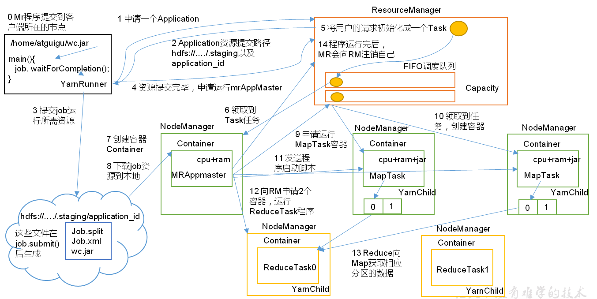
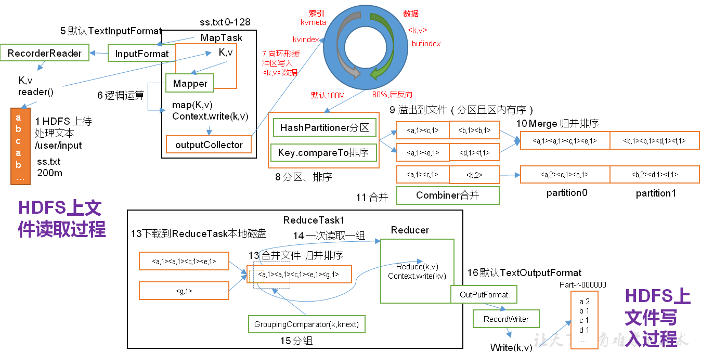
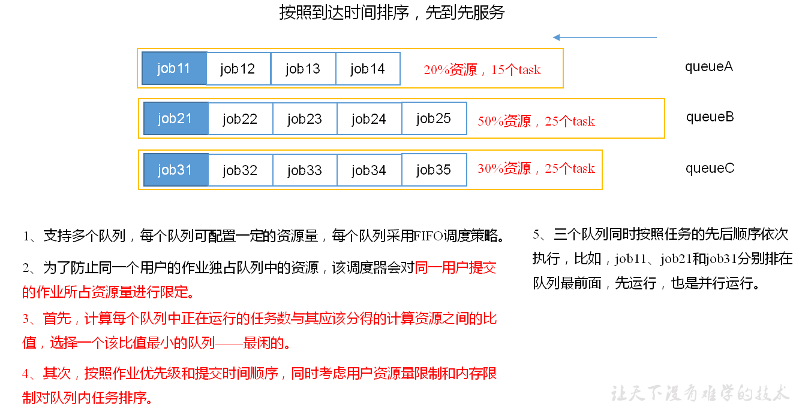
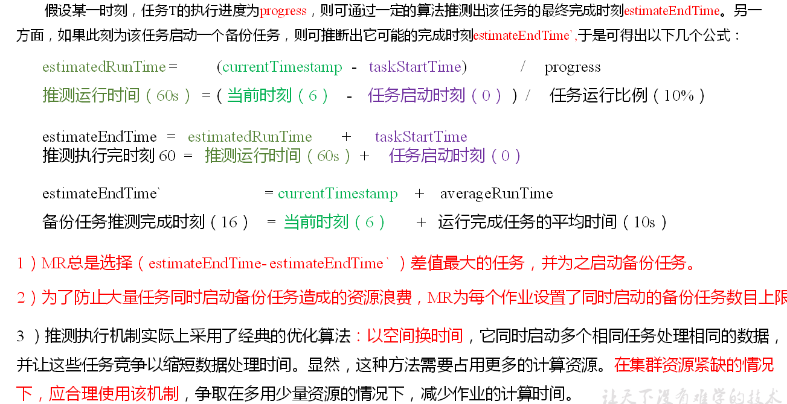

## YARN资源调度

> map和reduce容器通常使用的内存范围为1-4GB

YARN架构：


YARN工作机制：




作业提交全过程：
- 作业提交
- 作业初始化
- 任务分配
- 任务运行
- 进度和状态更新
> YARN中的任务将其进度和状态(包括counter)返回给应用管理器, 客户端每秒(通过mapreduce.client.progressmonitor.pollinterval设置)向应用管理器请求进度更新, 展示给用户。
- 作业完成

作业提交过程之MapReduce



调度策略（通过yarn.resourcemanager.scheduler.class配置）：
- 先进先出调度：FIFO
- 容量调度：Capacity Scheduler 默认的方式
- 公平调度：Fair Scheduler




开启推测执行任务机制
- 发现拖后腿的任务，比如运行速度远慢于任务平均速度（可能硬件老化有bug等），为拖后腿的任务启动一个备份任务，谁先完成就有谁的结果
- 前提条件：
    - 每个Task只能有一个备份任务
    - 当前Job已完成的task必须不小于5%
    - 开启推测执行参数设置。mapred-site.xml文件中默认是打开的
```
<property>
  	<name>mapreduce.map.speculative</name>
  	<value>true</value>
  	<description>If true, then multiple instances of some map tasks may be executed in parallel.</description>
</property>
<property>
  	<name>mapreduce.reduce.speculative</name>
  	<value>true</value>
  	<description>If true, then multiple instances of some reduce tasks may be executed in parallel.</description>
</property>

```
- 不能启动推测执行机制的情况：
    - 任务间存在严重的负载倾斜
    - 特殊任务，比如任务向数据库中写数据

- 推测执行算法原理

