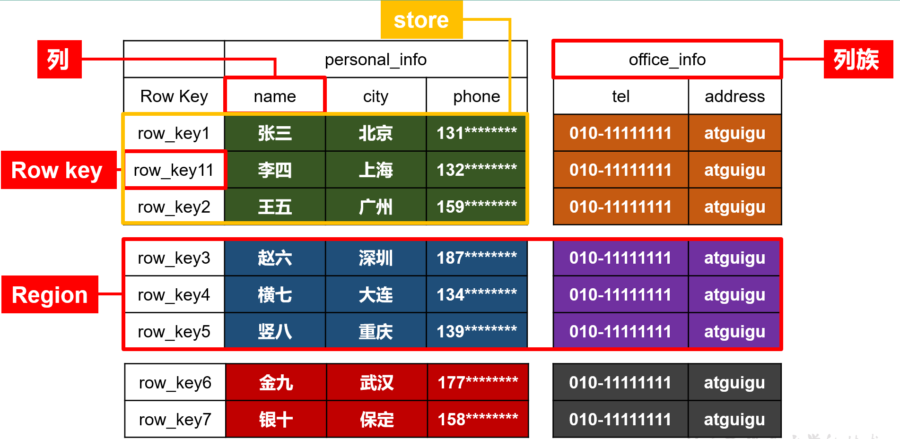
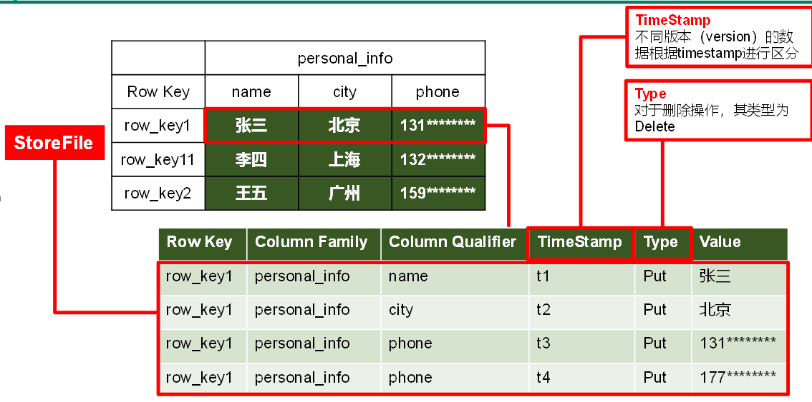
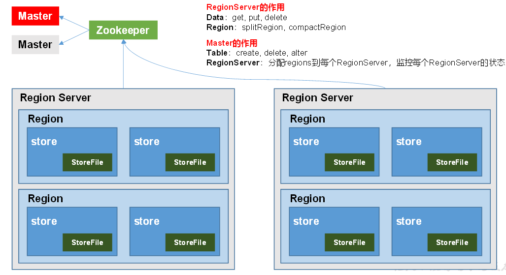

## HBase
关系型数据库的查询瓶颈：表的数据量达到几千万甚至几亿级别时，单条记录的检索将花费数秒甚至分钟级别，影响因素
- 高并发的更新
- 多表关联后的复杂查询以及频繁的group by 或者 order by

CAP原理
- Consistency（强一致性）：数据更新操作的一致性，所有数据变动都是同步的。
- Availability（高可用性）：良好的响应性能。
- Partition tolerance（高分区容错性）：可靠性。
> 任何分布式系统只能同时满足两点，无法三者兼顾

有些数据库在实现性能的同时会牺牲一部分一致性，即数据在更新时，不会立刻同步，而是经过了一段时间才达到一致性。这个特性也称之为**最终一致性**

### 1.HBase的特点
HBase是一种分布式、可扩展、支持海量数据存储的NoSQL数据库。面向列存储，构建与hadoop之上，提供对10亿级别表数据的快速随机实时读写。
- 海量存储
- 列式存储：指的是列族存储
- 极易扩展（RegionServer层面，以及HDFS层面）
- 高并发
- 稀疏：HBase的列具有灵活性，可以有任意多的列，在列数据为空时，不会占用存储空间

#### 1.1 HBase优点
HBase的优势主要在以下几方面：
- 海量数据存储
- 快速随机访问，高效访问
- 大量写操作的应用
- 高容错、高扩展

#### 1.2 HBase的缺点
- 架构设计复杂，且使用HDFS作为分布式存储，因此只是存储少量数据，它也不会很快。在大数据量时，它慢的不会很明显！
- Hbase不支持表的关联操作，因此数据分析是HBase的弱项。常见的 group by或order by只能通过编写MapReduce来实现！
- Hbase部分支持了ACID

#### 1.3 HBase使用场景
适合场景：单表超千万，上亿，且高并发！

不适合场景：主要需求是数据分析，比如做报表。数据量规模不大，对实时性要求高！

常见的应用场景：互联网搜索引擎数据存储（BigTable要解决的问题）
- 审计日志系统
- 实时系统
- 消息中心
- 内容服务系统

### 2.Hbase数据模型
#### 逻辑结构


#### 物理存储结构


#### 数据模型
- **命名空间NameSpace**：类似于关系型数据库的database概念,自带2个命名空间hbase和default。hbase为内置的，而default为用户默认的命名空间
- **表和区域（Table&Region）**：当表随着记录数不断增加而变大后，会逐渐分裂成多份，成为区域，一个区域是对表的水平划分，不同的区域会被Master分配给相应的RegionServer进行管理
> HBase定义表时只需要声明列族即可，数据属性，比如超时时间（TTL），压缩算法（COMPRESSION）等，都在列族的定义中定义
- **列族（Column Family）**：表在水平方向有一个或者多个列族组成，一个列族中可以由任意多个列组成
    - 列族支持动态扩展，无需预先定义列的数量以及类型（HBase能够轻松应对字段变更的场景）
    - 所有列均以二进制格式存储，**用户需要自行进行类型转换**
    - 所有的列族成员的前缀是相同的，例如“abc:a1”和“abc:a2”两个列都属于abc这个列族
    - 列族存在的意义是HBase会把相同列族的列尽量放在同一台机器上
    - 官方建议一张表的列族定义的越少越好，列族太多会极大程度地降低数据库性能
> 表的相关属性大部分都定义在列族上，同一个表里的不同列族可以有完全不同的属性配置，但是同一个列族内的所有列都会有相同的属性
- **行（Row）**：由一个RowKey和多个Column（列）组成，一个行包含了多个列，这些列通过列族来分类
- **行健（Row Key）**：表的主键，表中的记录默认按照行健升序排序
- **时间戳（Timestamp）**：每次数据操作对应的时间戳，可以看作是数据的版本号
- **单元格（Cell）**：表存储数据的单元。由{行健，列（列族:标签），时间戳}唯一确定，其中的数据是没有类型的，都是以二进制的形式存储

### 3.HBase基本架构



基本概念：
- Master服务器：一般一个集群只有一个，服务维护表结构信息
    - 只负责各种协调工作（很像打杂），比如建表、删表、移动Region、合并等操作。这些操作的共性是都需要跨RegionServer
    - 对于RegionServer的操作：分配regions到每个RegionServer，监控每个RegionServer的状态，负载均衡和故障转移
- RegionServer服务器：可以有多个，负责存储数据的地方，保存的表数据直接存在HDFS上（调用了HDFS的客户端接口）
    - RigionServer对Region的操作：splitRegion、compactRegion
    - 对数据的操作：get, put, delete
> HBase很特殊，客户端是直连RegionServer的，也就是master挂了以后还能查询，也可以存储和删除，但是无法新建表
- Region：一段数据的集合，一个HBase的表一般拥有一个到多个Region
    - Region由一个表的若干行组成！在Region中行的排序按照行键（rowkey）字典排序
    - Region不能跨RegionSever，数据量大的时候，HBase会拆分Region
    - 进行均衡负载的时候，也可能会把Region从一台服务器转到另一台服务器上
    - Region由RegionServer进程管理，一个服务器可以有一个或多个Region
- Zookeeper
    - HBase通过Zookeeper来做master的高可用、RegionServer的监控、元数据的入口以及集群配置的维护等工作
    - 非常依赖zookeeper，zk管理了所有RegionServer的信息，包括具体的数据段存放在哪个RegionServer上
    - 客户端每次与HBase连接，都是先跟zk通信，然后再与相应的RegionServer通信
- HBase在列上实现了BigTable论文提到的压缩算法、内存操作和布隆过滤器。
- HBase的表能够作为MapReduce任务的输入和输出，
- 可以通过Java API来存取数据，也可以通过REST、Avro或者Thrift的API来访问。
- 严格来说，HBASE是面向列族的


#### HBase存储机制
hbase的数据是存在HDFS上的，存储位置为：
```
库       /hbase/data/库名
表       /hbase/data/库名/表名
region  /hbase/data/库名/表名/region名
列族     /hbase/data/库名/表名/region名/列族名
数据     以文件的形式存在 /hbase/data/库名/表名/region名/列族名/ 下
```


### HBase的使用
> hbase shell不支持中文

启动HBase
```
方式1：
bin/start-hbase.sh

方式2：
bin/hbase-daemon.sh start master
bin/hbase-daemon.sh statt regionserver
```
#### 表的操作
##### list
##### create
创建表时，需要指定表名和列族名，而且至少需要指定一个列族，没有列族的表是没有任何意义的。
创建表时，还可以指定表的属性，表的属性需要指定在列族上！
- 格式1（需要指定列族属性时）
```
create '表名', { NAME => '列族名1', 属性名 => 属性值}, {NAME => '列族名2', 属性名 => 属性值}, …
```
- 格式2（不需要指定列族属性，可以简写）
```
create'表名','列族名1' ,'列族名2', …
```
##### desc
##### disable
停用表以后，防止对表做维护的时候客户端依然可以持续写入数据到表
- 删除表前，先停用
- 对表中的列进行修改的时候，也需要先停用表
> is_disabled 命令可以判断表是否停用
##### enable
- enable ‘表名’用来启用表
- is_enabled ‘表名’用来判断一个表是否被启用
- enable_all ‘正则表达式’可以通过正则来过滤表，启用复合条件的表

##### exists
##### count
##### drop
需要先手动disable
##### truncate
会自动先disable
##### get_split
获取表所对应的Region个数
##### alter


#### 数据操作
##### scan命令
scan命令可以按照rowkey的字典顺序来遍历指定的表的数据。
- scan ‘表名’：默认当前表的所有列族。
- scan ‘表名’,{COLUMNS=> [‘列族:列名’],…} ： 遍历表的指定列
- scan '表名', { STARTROW => '起始行键', ENDROW => '结束行键' }：指定rowkey范围。如果不指定，则会从表的开头一直显示到表的结尾。区间为左闭右开。
- scan '表名', { LIMIT => 行数量}： 指定返回的行的数量
- scan '表名', {VERSIONS => 版本数}：返回cell的多个版本
> VERSIONS默认是1，需要通过alter修改后才能保存多个版本的数据
- scan '表名', { TIMERANGE => [最小时间戳, 最大时间戳]}：指定时间戳范围
		注意：此区间是一个左闭右开的区间，因此返回的结果包含最小时间戳的记录，但是不包含最大时间戳记录
- scan '表名', { RAW => true, VERSIONS => 版本数}
	显示原始单元格记录，在Hbase中，被删掉的记录在HBase被删除掉的记录并不会立即从磁盘上清除，而是先被打上墓碑标记，然后等待下次major compaction的时候再被删除掉。注意RAW参数必须和VERSIONS一起使用，但是不能和COLUMNS参数一起使用。
- scan '表名', { FILTER => "过滤器"} and|or { FILTER => "过滤器"}: 使用过滤器扫描

##### put命令
- put可以新增记录还可以为记录设置属性。
- put '表名', '行键', '列名', '值'
- put '表名', '行键', '列名', '值',时间戳
- put '表名', '行键', '列名', '值', { '属性名' => '属性值'}
- put '表名', '行键', '列名', '值',时间戳, { '属性名' =>'属性值'}

##### get命令
get是一种特殊的scan命令，支持scan的大部分属性，如COLUMNS，TIMERANGE，VERSIONS，FILTER

##### delete命令
删除某rowkey的全部数据：
```HBase(main):016:0> deleteall 'student','1001'```
删除某rowkey的某一列数据：
```HBase(main):017:0> delete 'student','1002','info:sex'```

> 表只有enable，才能做表的更改


### 关于VERSIONS
每个不同时间戳的cell就是一个版本，时间戳就是版本

- 列族的VERSIONS：表示数据从MemStore刷新到StoreFile的时候最多保留多少个版本。如下所示，student的info列族的VERSIONS就是1
```
hbase(main):108:0> describe 'student'
Table student is ENABLED                                                                                                                                                                  
student                                                                                                                                                                                   
COLUMN FAMILIES DESCRIPTION                                                                                                                                                               
{NAME => 'allinfo', BLOOMFILTER => 'ROW', VERSIONS => '1', IN_MEMORY => 'false', KEEP_DELETED_CELLS => 'FALSE', DATA_BLOCK_ENCODING => 'NONE', TTL => 'FOREVER', COMPRESSION => 'NONE', MI
N_VERSIONS => '0', BLOCKCACHE => 'true', BLOCKSIZE => '65536', REPLICATION_SCOPE => '0'}                                                                                                  
{NAME => 'info', BLOOMFILTER => 'ROW', VERSIONS => '1', IN_MEMORY => 'false', KEEP_DELETED_CELLS => 'FALSE', DATA_BLOCK_ENCODING => 'NONE', TTL => 'FOREVER', COMPRESSION => 'NONE', MIN_V
ERSIONS => '0', BLOCKCACHE => 'true', BLOCKSIZE => '65536', REPLICATION_SCOPE => '0'}                                                                                                     
2 row(s) in 0.0130 seconds

# 将info列族的VERSIONS修改为3
hbase(main):109:0> alter 'student',{NAME=>'info',VERSIONS=>3}
Updating all regions with the new schema...
0/1 regions updated.
1/1 regions updated.
Done.
0 row(s) in 2.9670 seconds

hbase(main):110:0> describe 'student'
Table student is ENABLED                                                                                                                                                                  
student                                                                                                                                                                                   
COLUMN FAMILIES DESCRIPTION                                                                                                                                                               
{NAME => 'allinfo', BLOOMFILTER => 'ROW', VERSIONS => '1', IN_MEMORY => 'false', KEEP_DELETED_CELLS => 'FALSE', DATA_BLOCK_ENCODING => 'NONE', TTL => 'FOREVER', COMPRESSION => 'NONE', MI
N_VERSIONS => '0', BLOCKCACHE => 'true', BLOCKSIZE => '65536', REPLICATION_SCOPE => '0'}                                                                                                  
{NAME => 'info', BLOOMFILTER => 'ROW', VERSIONS => '3', IN_MEMORY => 'false', KEEP_DELETED_CELLS => 'FALSE', DATA_BLOCK_ENCODING => 'NONE', TTL => 'FOREVER', COMPRESSION => 'NONE', MIN_V
ERSIONS => '0', BLOCKCACHE => 'true', BLOCKSIZE => '65536', REPLICATION_SCOPE => '0'}                                                                                                     
2 row(s) in 0.0220 seconds
```
- 修改之后，MemStore进行flush操作的时候，最多会有三个最新版本的数据会flush到StoreFile中
- 执行scan命令的时候指定查询的版本号，表示最多显示多少个版本的数值，这些数值的来源有：StoreFile以及MemStore
```
scan 'student', {RAW=>true, VERSIONS=>10}
# 结果是，最多有3个来源于StoreFile，其余最多7个版本来源于MemStore
```
> 每put一次就会在MemStore新增一个版本的数据


```
# 对rowkey=1001的info:age更新两次数据
hbase(main):011:0> put 'student', '1001', 'info:age', 1
0 row(s) in 0.0810 seconds

hbase(main):012:0> put 'student', '1001', 'info:age', 2
0 row(s) in 0.0100 seconds
# 只能查到最新version的内容
hbase(main):013:0> get 'student', '1001'
COLUMN         CELL                                   
 info:age      timestamp=1628583509482, value=2       
 info:name     timestamp=1621056641969, value=boy     
1 row(s) in 0.0190 seconds
# 查看3个版本的内容
hbase(main):041:0> get 'student', '1001', {COLUMN=>'info:age',VERSIONS=>3}
COLUMN         CELL                                   
 info:age      timestamp=1628583509482, value=2       
 info:age      timestamp=1628583506150, value=1       
 info:age      timestamp=1621086119700, value=88      
1 row(s) in 0.0020 seconds

# 将数据删除后，会打上标识 type=DeleteColumn
hbase(main):043:0> delete 'student', '1001','info:age'
0 row(s) in 0.0180 seconds

hbase(main):047:0> scan 'student', {LIMIT=>2, RAW=>true, VERSIONS=>3}
ROW            COLUMN+CELL                            
 1001          column=info:age, timestamp=162858401661
               4, type=DeleteColumn                   
 1001          column=info:age, timestamp=162858350948
               2, value=2                             
 1001          column=info:age, timestamp=162858350615
               0, value=1                             
 1001          column=info:age, timestamp=162108611970
               0, value=88                            
 1001          column=info:name, timestamp=16210566419
               69, value=boy                          
 1002          column=info:name, timestamp=16210567151
               60, value=fancy                        
2 row(s) in 0.0070 seconds
```

