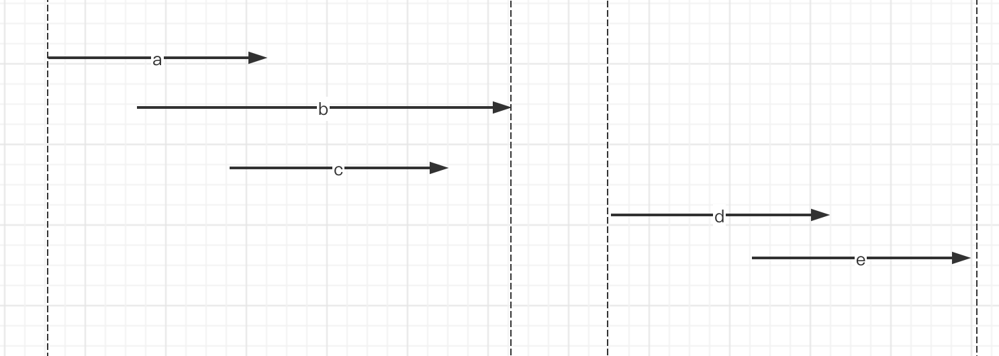

### 余额类每天补刷

### 时间段合并
需求：将相同的多个时间段合并成一条数据



核心思路：将能合并的数据分组，而分组的关键是找到分组的起点（在这里是起始时间），之后判断当前数据是否要和上一条数据合并
```
select  room_id
        , time_merge_flag
        , min(slice_start_ts)   as slice_start_ts
        , max(slice_end_ts)     as slice_end_ts
from    (
            select  tt1.room_id
                    , object_id
                    , slice_start_ts
                    , slice_end_ts
                    -- 当前数据：判断是否为新的起点，如果时间上有断点，那就是新的起点，否则不需要
                    , if(slice_start_ts <= tt1.last_slice_end_ts, 0, slice_start_ts) as x
                    -- 累加，将数据分组。因为要合并的那条数据是0，结合起点标识，就可以将数据分组
                    , sum(if(slice_start_ts <= tt1.last_slice_end_ts, 0, slice_start_ts)) OVER(PARTITION BY room_id ORDER BY slice_start_ts) as time_merge_flag
            from    (
                        select  room_id
                                , object_id
                                , slice_start_ts
                                , slice_end_ts
                                , third_tag_id
                                , lag(slice_start_ts,1,0) over(PARTITION BY room_id order by slice_start_ts)
                                                                                as last_slice_end_ts
                                , lag(slice_end_ts,1,0) over(PARTITION BY room_id order by slice_start_ts)
                                                                                as last_slice_end_ts
                        from    xxx
                        where   xxxxx
                    ) tt1
        ) table
group by room_id
        , time_merge_flag
```


### 分组后按顺序组装
需求描述：将一组切片数据，按时间顺序存到array中，并给到下游消费

通过 distribute by 来实现，可以保证collect_list组装的时候按顺序
> 知识点：执行顺序上，group by 执行后 having，之后就会执行 distribute by 或者 cluster by
```
            SELECT  room_id
                    , collect_list(map(
                                        "start_time", slice_start_ts
                                        , "end_time", slice_end_ts
                                        , "category_info", tag_names
                                        , "is_consistent_target_content",if(is_match_target=1, TRUE, FALSE)
                                    ))   as split_algorithm_mark
            from    (
                        select  room_id
                                , tag_names
                                , is_match_target
                                , is_time_merge
                                , min(slice_start_ts)   as slice_start_ts
                                , max(slice_end_ts)     as slice_end_ts
                                , sum(is_match_target)  as match_target_num
                                , sum(1)                as tag_slice_num
                        from    (
                                    .........
                                ) x
                        group by  room_id
                                , tag_names
                                , is_match_target
                                , is_time_merge
                        distribute by room_id sort by room_id, slice_start_ts
                    ) n91
            GROUP by room_id
```
### 行列互转


## 复杂SQL解析
### JSON数组
```

SELECT  *
        , size(xx)
from    (
select  result,
                    get_json_object(t.result, '$.node_details') as node_details
                    , from_json(get_json_object(t.result, '$.node_details'), 'array<string>') as xx
            from    (
                        select  '{"node_details":[{"event_id":6470,"event_name":"识别节点","process_detail":[{"group_id":150362,"group_name":"评论召回直播间","version":33},{"group_id":46993,"group_name":"封建迷信","version":7,"rule_detail":[{"rule_id":312487,"rule_name":"封建迷信_报生日"}]},{"group_id":37348,"group_name":"未成年相关","version":4},{"group_id":35273,"group_name":"词表","version":4},{"group_id":32324,"group_name":"导流识别","version":31}]},{"event_id":6471,"event_name":"识别节点"}]}' as result
                    ) t
) xxx
-- lateral view explode(
--     split(
--         regexp_replace(node_detail2, '\\},\\{"event_id"', '\\}@\\{"event_id"') ,'@'
--     )
-- ) list as a 
-- lateral view
--         json_tuple(a, 'event_id') ai as event_id

```