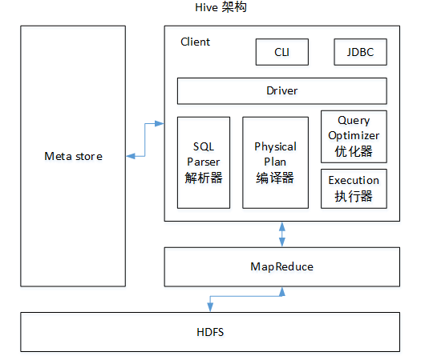

## Hive基础知识

#### Hive的优缺点：
- 优点：
    - 操作接口采用类SQL语法，提供快速开发的能力（简单、容易上手）。
    - 避免了去写MapReduce，减少开发人员的学习成本。
    - Hive的执行延迟比较高，因此Hive常用于数据分析，对实时性要求不高的场合。
    - Hive优势在于处理大数据，对于处理小数据没有优势，因为Hive的执行延迟比较高。
    - Hive支持用户自定义函数，用户可以根据自己的需求来实现自己的函数。
- 缺点：
    - Hive的HQL表达能力有限
        - 迭代式算法无法表达
        - 数据挖掘方面不擅长，由于MapReduce数据处理流程的限制，效率更高的算法却无法实现。
    - Hive的效率比较低
        - Hive自动生成的MapReduce作业，通常情况下不够智能化
        - Hive调优比较困难，粒度较粗


#### Hive架构原理



驱动器：Driver
- 解析器（SQL Parser）：将SQL字符串转换成抽象语法树AST，这一步一般都用第三方工具库完成，比如antlr；对AST进行语法分析，比如表是否存在、字段是否存在、SQL语义是否有误。
- 编译器（Physical Plan）：将AST编译生成逻辑执行计划。
- 优化器（Query Optimizer）：对逻辑执行计划进行优化。
- 执行器（Execution）：把逻辑执行计划转换成可以运行的物理计划。对于Hive来说，就是MR/Spark

#### JDBC访问
```
# 启动hiveserver2
bin/hiveserver2

# 启动beeline
bin/beeline

# 连接Hiveserver2
beeline> !connect jdbc:hive2://hadoop102:10000
```
#### Hive参数配置方式
有三种配置方式
- 配置文件方式：hive-site.xml，hive-default.xml
- 命令行参数方式： 只对本次hive启动有效
```
bin/hive -hiveconf mapred.reduce.tasks=10;
```
- 参数声明方式
```
hive (default)> set mapred.reduce.tasks=100;
# 查看参数配置情况
hive (default)> set mapred.reduce.tasks=100;
```

#### Hive数据类型
- 基本数据类型
    - string，相当于数据库的varchar，理论上最大可以存储2GB字符数
- 集合数据类型
    - struct：类似于C语言的Struct
    - map：类似于java的Map
    - array：类似于java的Array
```
create table test(
name string,
friends array<string>,
children map<string, int>,
address struct<street:string, city:string>
)
row format delimited fields terminated by ','
collection items terminated by '_'
map keys terminated by ':'
lines terminated by '\n';
```