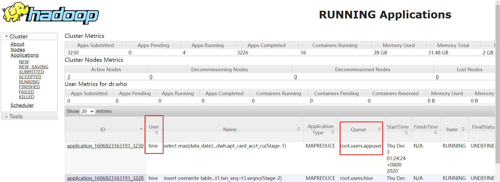

## beeline使用

```
Usage: java org.apache.hive.cli.beeline.BeeLine 
   -u <database url>               the JDBC URL to connect to
   -r                              reconnect to last saved connect url (in conjunction with !save)
   -n <username>                   the username to connect as
   -p <password>                   the password to connect as
   -d <driver class>               the driver class to use
   -i <init file>                  script file for initialization
   -e <query>                      query that should be executed
   -f <exec file>                  script file that should be executed
   -w (or) --password-file <password file>  the password file to read password from
   --hiveconf property=value       Use value for given property
   --hivevar name=value            hive variable name and value
                                   This is Hive specific settings in which variables
                                   can be set at session level and referenced in Hive
                                   commands or queries.
   --property-file=<property-file> the file to read connection properties (url, driver, user, password) from
   --color=[true/false]            control whether color is used for display
   --showHeader=[true/false]       show column names in query results
   --headerInterval=ROWS;          the interval between which heades are displayed
   --fastConnect=[true/false]      skip building table/column list for tab-completion
   --autoCommit=[true/false]       enable/disable automatic transaction commit
   --verbose=[true/false]          show verbose error messages and debug info
   --showWarnings=[true/false]     display connection warnings
   --showNestedErrs=[true/false]   display nested errors
   --numberFormat=[pattern]        format numbers using DecimalFormat pattern
   --force=[true/false]            continue running script even after errors
   --maxWidth=MAXWIDTH             the maximum width of the terminal
   --maxColumnWidth=MAXCOLWIDTH    the maximum width to use when displaying columns
   --silent=[true/false]           be more silent
   --autosave=[true/false]         automatically save preferences
   --outputformat=[table/vertical/csv2/tsv2/dsv/csv/tsv]  format mode for result display
                                   Note that csv, and tsv are deprecated - use csv2, tsv2 instead
  --truncateTable=[true/false]    truncate table column when it exceeds length
   --delimiterForDSV=DELIMITER     specify the delimiter for delimiter-separated values output format (default: |)
   --isolation=LEVEL               set the transaction isolation level
   --nullemptystring=[true/false]  set to true to get historic behavior of printing null as empty string
   --help                          display this message
```

使用案例
```
  Example:
    1. Connect using simple authentication to HiveServer2 on localhost:10000
    $ beeline -u jdbc:hive2://localhost:10000 username password

    2. Connect using simple authentication to HiveServer2 on hs.local:10000 using -n for username and -p for password
    $ beeline -n username -p password -u jdbc:hive2://hs2.local:10012

    3. Connect using Kerberos authentication with hive/localhost@mydomain.com as HiveServer2 principal
    $ beeline -u "jdbc:hive2://hs2.local:10013/default;principal=hive/localhost@mydomain.com

    4. Connect using SSL connection to HiveServer2 on localhost at 10000
    $ beeline jdbc:hive2://localhost:10000/default;ssl=true;sslTrustStore=/usr/local/truststore;trustStorePassword=mytruststorepassword

    5. Connect using LDAP authentication
    $ beeline -u jdbc:hive2://hs2.local:10013/default <ldap-username> <ldap-password>
 
```

#### 实践经验
- beeline -n xxx 指定用户之后，默认也会把任务提交到yarn的队列：root.users.xxx

```beeline -u "jdbc:hive2://dxbigdata102:10000" -n appuser -e "select max(data_date) x from wcl_dwh.apt_card_acct_cu"```
 

