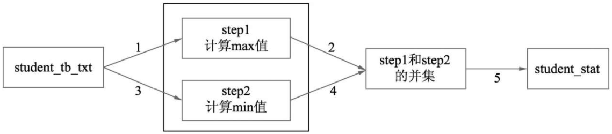
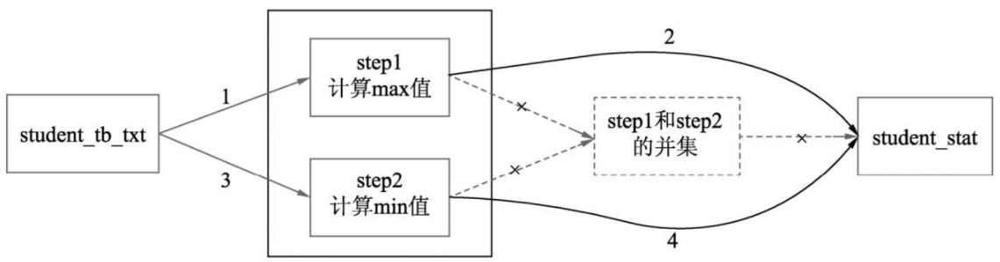
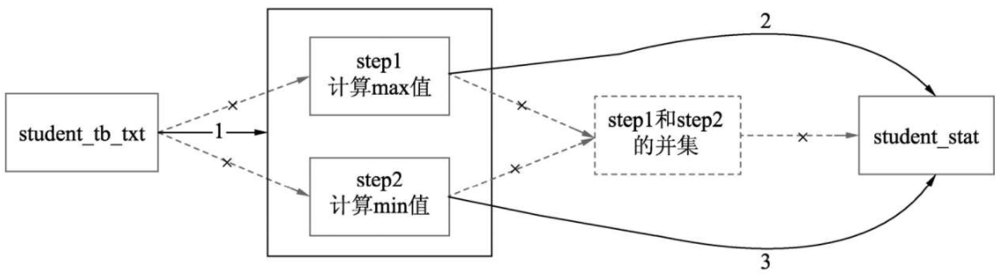
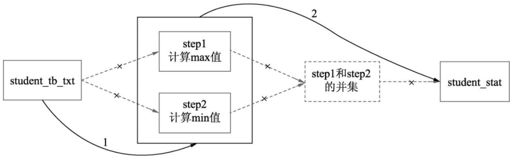

## 01感受hive性能调优的多样式

### 1.1感受改写SQL对性能的影响
```sparksql
-- 案例1.3 创建一张新的统计表
create table forlearn.student_stat
(
    a bigint, b bigint
) partitioned by (tp  string)
STORED AS TEXTFILE;
--开启动态分区
set hive.exec.dynamic.partition=true;
set hive.exec.dynamic.partition.mode=nonstrict;
--找出各个年龄段最早和最晚出生的信息，并将这两部分信息使用union进行合并写入student_stat中
insert into table forlearn.student_stat partition(tp)
select s_age, max(s_birth) stat, 'max' tp
from student_tb_txt
group by s_age
union all
select s_age, min(s_birth) stat, 'min' tp
from student_tb_txt
group by s_age;
```

示例1.3的执行

- 优化点1：减少中间落盘环节，减少IO

- 优化点2：一次读取源表

- 优化点3：max和min的计算放到一个MR中进行


```sparksql
-- 案例1.4 去掉union计算max和min
DROP TABLE if EXISTS forlearn.student_stat;
--创建student_stat
create table student_stat
(
    a bigint
    , b bigint
) partitioned by (tp  string)
STORED AS TEXTFILE;
--开启动态分区
set hive.exec.dynamic.partition=true;
set hive.exec.dynamic.partition.mode=nonstrict;
-- 优化点2：从源表只读一次
-- 注意把from写在了前面
from student_tb_txt
INSERT into table student_stat partition(tp)
select s_age, min(s_birth) stat, 'min' tp
group by s_age
-- 优化点1：去掉union过程，减少中间数据的落盘，而是直接到结果表
insert into table  student_stat partition(tp)
select s_age, max(s_birth) stat, 'max' tp
group by s_age;
```

**失败的优化**：没有使用MULTI-TABLE-INSERT的写法，直接拆成多个简单sql，如下所示。
```sparksql
-- 示例1.5
drop table if exists student_stat;
create table student_stat(a bigint, b bigint) partitioned by (tp  string)
STORED AS TEXTFILE;
set hive.exec.dynamic.partition=true;
set hive.exec.dynamic.partition.mode=nonstrict;
--计算max值
insert into table student_stat partition(tp)
select s_age, max(s_birth) stat, 'max' tp
from student_tb_txt
group by s_age;
--计算min值
insert into table student_stat partition(tp)
select s_age, min(s_birth) stat, 'min' tp
from student_tb_txt
group by s_age;
```
> 结果测试，示例1.5的结果反而比1.3慢了16分钟。这是因为hive早期的版本，示例1.5确实是1.3的优化版本，但后面hive对union做了优化，导致示例1.5反而更慢了。

结论：**某些调优方式随着版本的迭代，也逐渐变得不再适用**

#### 拓展：
- Hive执行计划是预测的，不像oracle有真实的计划。
- HiveSQL在执行时会转化为各种计算引擎能够运行的算子。作为HiveSQL的使用者，想要写出更加有效率的HiveSQL代码和MR代码，
  就需要去理解HiveSQL是如何转化为各种计算引擎所能运行的算子的。怎么做到？
  分为两步：第一步，理解基本的MR 过程和原理，第二步，在日常编写SQL 的过程中，尝试将SQL拆解成计算引擎对应的算子，
  拆解完和执行计划进行比对，还要和实际执行过程的算子比对，并思考自己拆解完后的算子与通过explain方式得到的算子的执行计划的异同
- MR任务有一个缺点，即启动一次作业需要多次读/写磁盘，因为MR会将中间结果写入磁盘，而且为了保障磁盘的读写效率和网络传输效率，会进行多次排序

### 1.2感受调整数据块大小对性能的影响

### 1.3 感受不同数据格式对性能的提升


### 1.4 感受不同的表设计对性能的提升


### 1.5

Hive的调优是一项综合性的工作

学习Hive 及其关联的几个组件之间的基本原理和各个组件之间的关系，并不断在练习中思考这些基本原理和性能的关系，
建立一个全链路的性能全局观