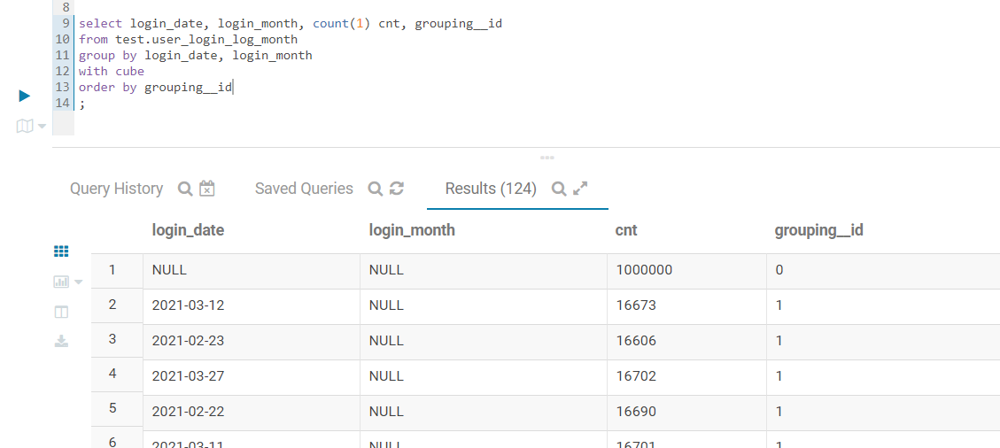
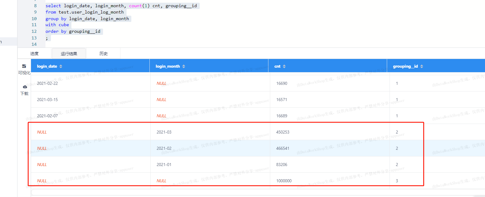

```
explain 
select name, count(1) cnt from zxc.user_login_log group by name ;
```
得到执行计划：
```
STAGE DEPENDENCIES:
  Stage-1 is a root stage
  Stage-0 depends on stages: Stage-1

STAGE PLANS:
  Stage: Stage-1
    Map Reduce
      Map Operator Tree:
          TableScan
            alias: user_login_log
            Statistics: Num rows: 414514 Data size: 41451436 Basic stats: COMPLETE Column stats: NONE
            Select Operator
              expressions: name (type: string)
              outputColumnNames: name
              Statistics: Num rows: 414514 Data size: 41451436 Basic stats: COMPLETE Column stats: NONE
              Group By Operator
                aggregations: count(1)
                keys: name (type: string)
                mode: hash
                outputColumnNames: _col0, _col1
                Statistics: Num rows: 414514 Data size: 41451436 Basic stats: COMPLETE Column stats: NONE
                Reduce Output Operator
                  key expressions: _col0 (type: string)
                  sort order: +
                  Map-reduce partition columns: _col0 (type: string)
                  Statistics: Num rows: 414514 Data size: 41451436 Basic stats: COMPLETE Column stats: NONE
                  value expressions: _col1 (type: bigint)
      Reduce Operator Tree:
        Group By Operator
          aggregations: count(VALUE._col0)
          keys: KEY._col0 (type: string)
          mode: mergepartial
          outputColumnNames: _col0, _col1
          Statistics: Num rows: 207257 Data size: 20725718 Basic stats: COMPLETE Column stats: NONE
          File Output Operator
            compressed: false
            Statistics: Num rows: 207257 Data size: 20725718 Basic stats: COMPLETE Column stats: NONE
            table:
                input format: org.apache.hadoop.mapred.TextInputFormat
                output format: org.apache.hadoop.hive.ql.io.HiveIgnoreKeyTextOutputFormat
                serde: org.apache.hadoop.hive.serde2.lazy.LazySimpleSerDe

  Stage: Stage-0
    Fetch Operator
      limit: -1
      Processor Tree:
        ListSink
```

设置使用spark引擎
``` set hive.execution.engine=spark;```
得到的执行计划如下：
```
STAGE DEPENDENCIES:
  Stage-1 is a root stage
  Stage-0 depends on stages: Stage-1

STAGE PLANS:
  Stage: Stage-1
    Spark
      Edges:
        Reducer 2 <- Map 1 (GROUP, 2)
      DagName: hive_20210328162121_04f3318f-2227-4ae2-8efc-782e22f371cf:1
      Vertices:
        Map 1 
            Map Operator Tree:
                TableScan
                  alias: user_login_log
                  Statistics: Num rows: 414514 Data size: 41451436 Basic stats: COMPLETE Column stats: NONE
                  Select Operator
                    expressions: name (type: string)
                    outputColumnNames: name
                    Statistics: Num rows: 414514 Data size: 41451436 Basic stats: COMPLETE Column stats: NONE
                    Group By Operator
                      aggregations: count(1)
                      keys: name (type: string)
                      mode: hash
                      outputColumnNames: _col0, _col1
                      Statistics: Num rows: 414514 Data size: 41451436 Basic stats: COMPLETE Column stats: NONE
                      Reduce Output Operator
                        key expressions: _col0 (type: string)
                        sort order: +
                        Map-reduce partition columns: _col0 (type: string)
                        Statistics: Num rows: 414514 Data size: 41451436 Basic stats: COMPLETE Column stats: NONE
                        value expressions: _col1 (type: bigint)
        Reducer 2 
            Reduce Operator Tree:
              Group By Operator
                aggregations: count(VALUE._col0)
                keys: KEY._col0 (type: string)
                mode: mergepartial
                outputColumnNames: _col0, _col1
                Statistics: Num rows: 207257 Data size: 20725718 Basic stats: COMPLETE Column stats: NONE
                File Output Operator
                  compressed: false
                  Statistics: Num rows: 207257 Data size: 20725718 Basic stats: COMPLETE Column stats: NONE
                  table:
                      input format: org.apache.hadoop.mapred.TextInputFormat
                      output format: org.apache.hadoop.hive.ql.io.HiveIgnoreKeyTextOutputFormat
                      serde: org.apache.hadoop.hive.serde2.lazy.LazySimpleSerDe

  Stage: Stage-0
    Fetch Operator
      limit: -1
      Processor Tree:
        ListSink
```

### 使用cube语法时的差异
```
select login_date, login_month, count(1) cnt, grouping__id
from test.user_login_log_month
group by login_date, login_month
with cube
order by grouping__id
```
- hive: grouping__id从 all->login_date->login_month->(login_date,login_month)递增


- spark：grouping__id从(login_date,login_month)->login_date->login_month->all递增



因此可以得到结论：对于2个维度的cube，一共有4种组合情况，grouping__id的取值如下：

维度组合 | hive下的grouping__id | spark下的grouping__id
--- | --- | ---
null | 0 | 3
login_date | 1 | 1
login_month | 2 | 2
login_date, login_month | 3 | 0

执行计划的差异如下：
- hive
```
 STAGE DEPENDENCIES:                                
   Stage-1 is a root stage                          
   Stage-2 depends on stages: Stage-1               
   Stage-0 depends on stages: Stage-2               
                                                    
 STAGE PLANS:                                       
   Stage: Stage-1                                   
     Map Reduce                                     
       Map Operator Tree:                           
           TableScan                                
             alias: user_login_log_month            
             Statistics: Num rows: 1000000 Data size: 47439122 Basic stats: COMPLETE Column stats: NONE 
             Select Operator                        
               expressions: login_date (type: string), login_month (type: string) 
               outputColumnNames: login_date, login_month 
               Statistics: Num rows: 1000000 Data size: 47439122 Basic stats: COMPLETE Column stats: NONE 
               Group By Operator                    
                 aggregations: count(1)             
                 keys: login_date (type: string), login_month (type: string), '0' (type: string) 
                 mode: hash                         
                 outputColumnNames: _col0, _col1, _col2, _col3 
                 Statistics: Num rows: 4000000 Data size: 189756488 Basic stats: COMPLETE Column stats: NONE 
                 Reduce Output Operator             
                   key expressions: _col0 (type: string), _col1 (type: string), _col2 (type: string) 
                   sort order: +++                  
                   Map-reduce partition columns: _col0 (type: string), _col1 (type: string), _col2 (type: string) 
                   Statistics: Num rows: 4000000 Data size: 189756488 Basic stats: COMPLETE Column stats: NONE 
                   value expressions: _col3 (type: bigint) 
       Reduce Operator Tree:                        
         Group By Operator                          
           aggregations: count(VALUE._col0)         
           keys: KEY._col0 (type: string), KEY._col1 (type: string), KEY._col2 (type: string) 
           mode: mergepartial                       
           outputColumnNames: _col0, _col1, _col2, _col3 
           Statistics: Num rows: 2000000 Data size: 94878244 Basic stats: COMPLETE Column stats: NONE 
           Select Operator                          
             expressions: _col0 (type: string), _col1 (type: string), _col3 (type: bigint), _col2 (type: string) 
             outputColumnNames: _col0, _col1, _col2, _col3 
             Statistics: Num rows: 2000000 Data size: 94878244 Basic stats: COMPLETE Column stats: NONE 
             File Output Operator                   
               compressed: false                    
               table:                               
                   input format: org.apache.hadoop.mapred.SequenceFileInputFormat 
                   output format: org.apache.hadoop.hive.ql.io.HiveSequenceFileOutputFormat 
                   serde: org.apache.hadoop.hive.serde2.lazybinary.LazyBinarySerDe 
                                                    
   Stage: Stage-2                                   
     Map Reduce                                     
       Map Operator Tree:                           
           TableScan                                
             Reduce Output Operator                 
               key expressions: _col3 (type: string) 
               sort order: +                        
               Statistics: Num rows: 2000000 Data size: 94878244 Basic stats: COMPLETE Column stats: NONE 
               value expressions: _col0 (type: string), _col1 (type: string), _col2 (type: bigint) 
       Reduce Operator Tree:                        
         Select Operator                            
           expressions: VALUE._col0 (type: string), VALUE._col1 (type: string), VALUE._col2 (type: bigint), KEY.reducesinkkey0 (type: string) 
           outputColumnNames: _col0, _col1, _col2, _col3 
           Statistics: Num rows: 2000000 Data size: 94878244 Basic stats: COMPLETE Column stats: NONE 
           File Output Operator                     
             compressed: false                      
             Statistics: Num rows: 2000000 Data size: 94878244 Basic stats: COMPLETE Column stats: NONE 
             table:                                 
                 input format: org.apache.hadoop.mapred.TextInputFormat 
                 output format: org.apache.hadoop.hive.ql.io.HiveIgnoreKeyTextOutputFormat 
                 serde: org.apache.hadoop.hive.serde2.lazy.LazySimpleSerDe 
                                                    
   Stage: Stage-0                                   
     Fetch Operator                                 
       limit: -1                                    
       Processor Tree:                              
         ListSink                                   
                                                    
```
- spark
```
STAGE DEPENDENCIES:
  Stage-1 is a root stage
  Stage-0 depends on stages: Stage-1

STAGE PLANS:
  Stage: Stage-1
    Spark
      Edges:
        Reducer 2 <- Map 1 (GROUP, 6)
        Reducer 3 <- Reducer 2 (SORT, 1)
      DagName: hive_20210328173838_5f6852d0-8ef4-4049-9eb8-5ca1584a46bb:2
      Vertices:
        Map 1 
            Map Operator Tree:
                TableScan
                  alias: user_login_log_month
                  Statistics: Num rows: 1000000 Data size: 47439122 Basic stats: COMPLETE Column stats: NONE
                  Select Operator
                    expressions: login_date (type: string), login_month (type: string)
                    outputColumnNames: login_date, login_month
                    Statistics: Num rows: 1000000 Data size: 47439122 Basic stats: COMPLETE Column stats: NONE
                    Group By Operator
                      aggregations: count(1)
                      keys: login_date (type: string), login_month (type: string), '0' (type: string)
                      mode: hash
                      outputColumnNames: _col0, _col1, _col2, _col3
                      Statistics: Num rows: 4000000 Data size: 189756488 Basic stats: COMPLETE Column stats: NONE
                      Reduce Output Operator
                        key expressions: _col0 (type: string), _col1 (type: string), _col2 (type: string)
                        sort order: +++
                        Map-reduce partition columns: _col0 (type: string), _col1 (type: string), _col2 (type: string)
                        Statistics: Num rows: 4000000 Data size: 189756488 Basic stats: COMPLETE Column stats: NONE
                        value expressions: _col3 (type: bigint)
        Reducer 2 
            Reduce Operator Tree:
              Group By Operator
                aggregations: count(VALUE._col0)
                keys: KEY._col0 (type: string), KEY._col1 (type: string), KEY._col2 (type: string)
                mode: mergepartial
                outputColumnNames: _col0, _col1, _col2, _col3
                Statistics: Num rows: 2000000 Data size: 94878244 Basic stats: COMPLETE Column stats: NONE
                Select Operator
                  expressions: _col0 (type: string), _col1 (type: string), _col3 (type: bigint), _col2 (type: string)
                  outputColumnNames: _col0, _col1, _col2, _col3
                  Statistics: Num rows: 2000000 Data size: 94878244 Basic stats: COMPLETE Column stats: NONE
                  Reduce Output Operator
                    key expressions: _col3 (type: string)
                    sort order: +
                    Statistics: Num rows: 2000000 Data size: 94878244 Basic stats: COMPLETE Column stats: NONE
                    value expressions: _col0 (type: string), _col1 (type: string), _col2 (type: bigint)
        Reducer 3 
            Reduce Operator Tree:
              Select Operator
                expressions: VALUE._col0 (type: string), VALUE._col1 (type: string), VALUE._col2 (type: bigint), KEY.reducesinkkey0 (type: string)
                outputColumnNames: _col0, _col1, _col2, _col3
                Statistics: Num rows: 2000000 Data size: 94878244 Basic stats: COMPLETE Column stats: NONE
                File Output Operator
                  compressed: false
                  Statistics: Num rows: 2000000 Data size: 94878244 Basic stats: COMPLETE Column stats: NONE
                  table:
                      input format: org.apache.hadoop.mapred.TextInputFormat
                      output format: org.apache.hadoop.hive.ql.io.HiveIgnoreKeyTextOutputFormat
                      serde: org.apache.hadoop.hive.serde2.lazy.LazySimpleSerDe

  Stage: Stage-0
    Fetch Operator
      limit: -1
      Processor Tree:
        ListSink

```
