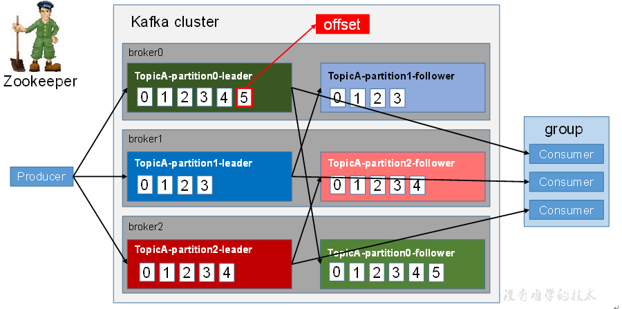
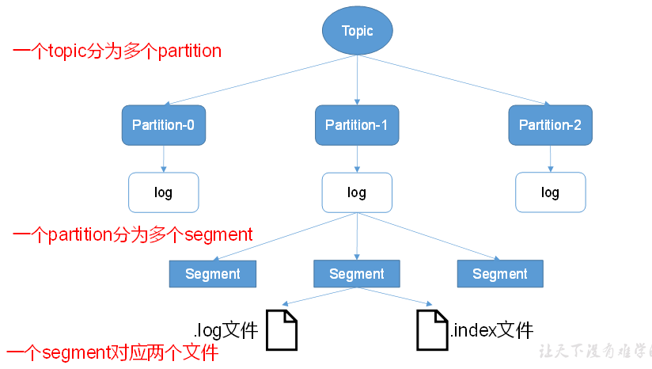
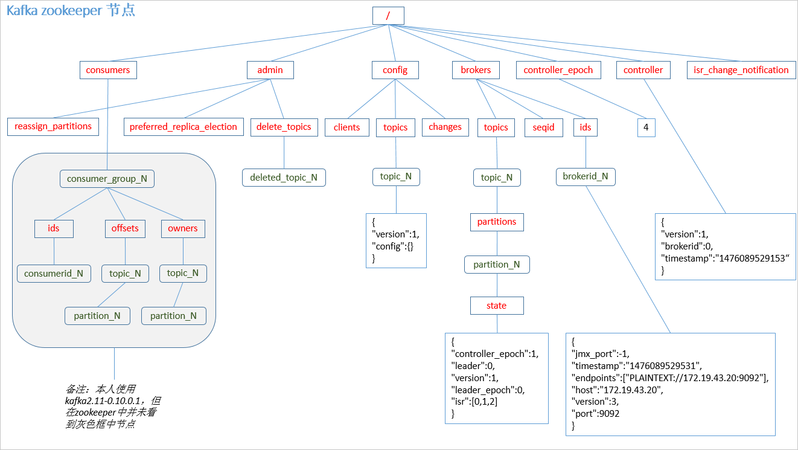
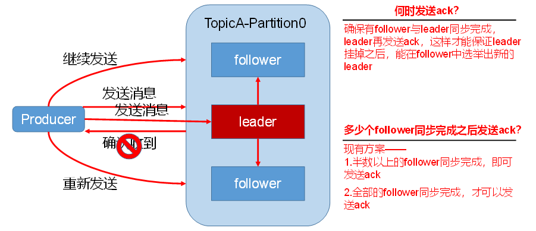
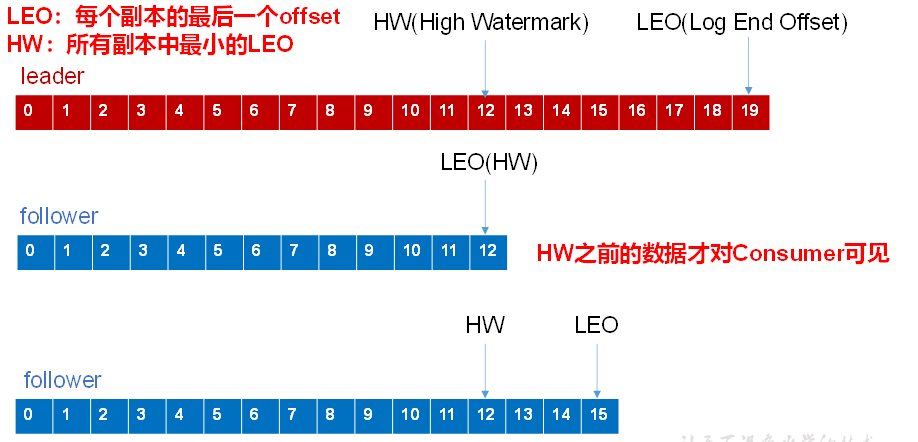
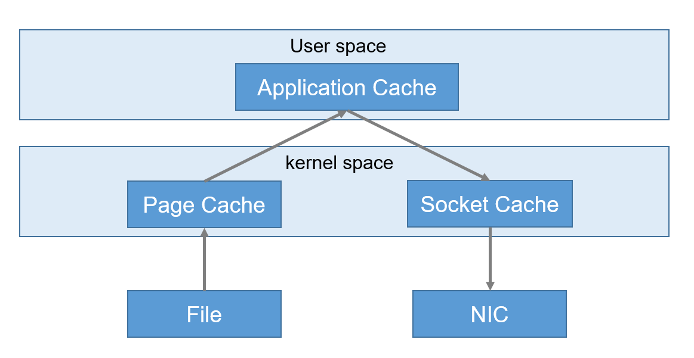
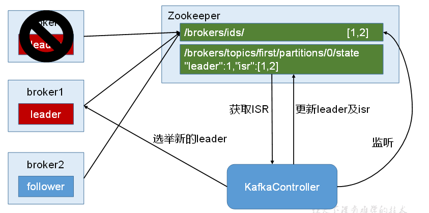
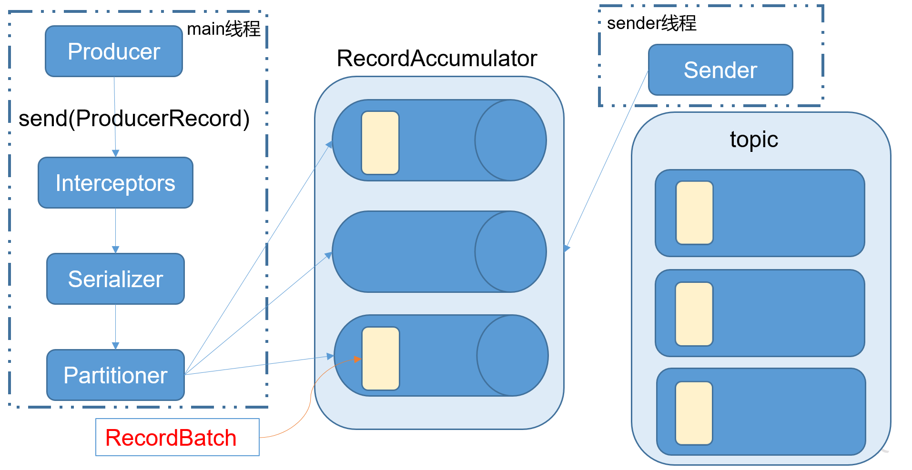

## Kafka
Kafka是一个分布式的基于发布/订阅模式的消息队列，主要应用于大数据实时处理领域
> 消息队列的两种模式：
> 1.点对点模式（1对1）：消费了之后删除
> 2.发布订阅模式（1对多）：数据会存储起来一般过段时间才会删除

#### 概念
- broker：每个kafka实例server，多个broker组成kafka集群，一个broker可以容纳多个topic
- topic: 类似于表，kafka对消息保存时依据topic父类。也可以理解为就是一个队列
- partition：分区，相当于文件夹，一个分区是一个有序的队列
> 理论上partition数越多，吞吐率越高。（但也不能太大，否则broker宕机时重新恢复很慢）。做负载均衡用
- replication：副本，保证节点挂了数据也不丢失。一个topic的每个分区都有若干个副本，一个leader和若干个follower
    - leader：每个分区多个副本的主。生产者发送数据的时候发送到leader，消费者消费的时候也是到leader去获取数据
    - follower：每个分区多个副本的从。主要从leader同步数据，leader故障时，follower接替工作
- producer：生产者，向broker发送数据
- consumer
    - 从broker消费数据
    - consumer group 消费组，也需要用zookeeper管理：用来实现一个topic消息的广播和单播
    - 同一个消费者组不能同时消费同一个分区，可以消费不同的分区
> 消费者组内每个消费者负责消费不同分区的数据，一个分区只能由一个消费者消费；消费者组之间互不影响。所有的消费者都属于某个消费者组，即消费者组是逻辑上的一个订阅者
- 持久化
> 可以设置数据保留策略，在保留时限内可以随时被消费，时限到了会清楚数据并释放空间

### 深入kafka
#### 1.工作流程和存储机制

- topic 是逻辑上的概念，partition是物理上的概念，一个partition对应一个log文件

##### 存储机制

- 存储方式
    - 物理上把topic分成一个或多个patition（对应 server.properties 中的num.partitions=3配置）
    - 每个patition物理上对应一个文件夹（该文件夹存储该patition的所有消息和索引文件）
    - 为防止log文件过大导致数据定位效率低下，Kafka采取了**分片和索引**机制，将每个partition分为多个segment
    - segment的文件生命周期由服务端配置参数（log.segment.bytes，log.roll.{ms,hours}等若干参数）决定
    - 每个segment对应两个文件——“.index”文件和“.log”文件
        - .index 索引文件
        - .log 数据文件
        - 这两个文件的命名规则：partition全局的第一个segment从0开始，后续每个segment文件名为上一个segment文件最后一条消息的offset值
- 存储策略
    - 无论消息是否被消费，kafka都会保留所有消息。
    - 有两种策略可以删除旧数据：
        - 基于时间：log.retention.hours=168
        - 基于大小：log.retention.bytes=1073741824
- ZooKeeper存储结构

    - 重点关注consumer和broker
    - producer不在zk中注册，消费者在zk中注册

#### 2.生产者
##### 2.1分区策略：
- 分区原因：方便在集群中扩展，可以提高并发度（以partition为读写单位）
- 分区策略：
    - 指定了patition，则直接使用；
    - 未指定patition但指定key，通过对key取hash值与partition数进行取余得到partition值
    - patition和key都未指定，使用轮询选出一个patition
> 第一次调用时随机生成一个整数（后面每次调用在这个整数上自增），将这个值与 topic 可用的 partition 总数取余得到 partition 值，也就是常说的 round-robin 算法

##### 2.2数据可靠性保证

- 副本数据同步策略：Kafka选择第二种（所有follower全部同步完成才发ack）
    - 同样为了容忍n台节点的故障，这种方案只需要n+1个副本，第一种方案会造成大量数据的冗余
    - 虽然第二种方案的网络延迟会比较高，但网络延迟对Kafka的影响较小

**ISR:**
- 如果leader收到数据，但是有一个follower迟迟没有完成同步导致ack一直没有发送，怎么办？
- Leader实际上维护了一个动态的in-sync replica set (ISR)，意为和leader保持同步的follower集合。
    - 当ISR中的follower完成数据的同步之后leader就会给follower发送ack。
    - 如果follower长时间未向leader同步数据，则该follower将被踢出ISR，该时间阈值由replica.lag.time.max.ms参数设定。
    - Leader发生故障之后，就会从ISR中选举新的leader
    
**ack应答机制，有三种级别**
    - 0：producer不等待broker的ack，当broker发生故障是数据可能丢失
    - 1：leader接收到数据落地后，producer就会收到ack，如果follower同步数据成功之前leader挂了，数据就会丢失
    - -1：producer等待broker的ack，而且是leader和follower都落盘成功后收到ack。follower成功后broker发送ack之前leader发生故障，这时会造成数据重复
> 也就是说：这只能保证副本之间的数据一致性，并不能保证数据不丢失或者不重复

**故障处理细节**

- LEO：Log End Offset，每个副本最后一个offset
- HW: High Watermark，最高水位，也就是说所有副本中最小的LEO
- follower故障：会被剔除ISR，恢复后会读取本地记录的上次的HW，将log文件中高于HW的部分截取掉，之后从HW开始从leader进行同步
- leader故障：从ISR中选举新的leader。之后为保证一致性，其他follower会将各自log文件中高于HW的部分截取掉，从新的leader同步数据

##### 2.3 Exactly Once语义（保证每条消息被发送且仅被发送一次）
0.11版本之后，Kafka Producer引入了幂等性机制（idempotent），配合acks = -1时的at least once语义，实现了producer到broker的exactly once语义
```idempotent + at least once = exactly once```
使用时，只需将enable.idempotence属性设置为true，kafka自动将acks属性设为-1，并将retries属性设为Integer.MAX_VALUE

#### 2.4 Kafka生产过程分析
- 写入方式
    - 消息被采用push模式推送到broker中，追加写入partition中，属于顺序写磁盘（比随机内存效率高，保证吞吐率）
- 分区
    - 消息被发送到topic的分区中，offset在分区类有效且唯一
- 副本
    - 在replication之间选出一个leader
    - producer和consumer只与这个leader交互，其它replication作为follower从leader中复制数据
- 写入流程
    - 1.producer先从zookeeper的 "/brokers/.../state"节点找到该partition的leader
    - 2.producer将消息发送给该leader
    - 3.leader将消息写入本地log
    - 4.followers从leader pull消息，写入本地log后向leader发送ACK
    - 5.leader收到所有ISR中的replication的ACK后，增加HW（high watermark，最后commit 的offset）并向producer发送ACK


#### 3. Kafka消费者
##### 3.1消费方式
consumer采用pull方式从broker中读取数据。不使用push方式的原因：不同消费者的消费速率不一致容易导致拒绝服务以及网络拥塞
> 对于Kafka而言，pull模式更合适，它可简化broker的设计，consumer可自主控制消费消息的速率，同时consumer可以自己控制消费方式——即可批量消费也可逐条消费

pull方式的不足之处在于当kafka中没有数据时，consumer会陷入空循环中

##### 3.2分区分配策略
一个topic会有多个分区，而一个消费者组也会有多个消费者，所以就涉及分区如何分配给消费者。

当以下情形发生时，kafka会进行一次分区分配
> 将分区的所有权从一个消费者移到另一个消费者称为重新平衡（rebalance）
- 同一个消费者组新增消费者时
- 消费者离开当前消费者组时，包括shut down或者crash
- 订阅的主题新增分区

策略有两种：
- RoundRobin：轮询。partition0给消费者2，partition1给消费者3，partition2给消费者1。以此类推
- Range：默认的策略。将一个范围内的分区分给一个消费者，比如partition0-partition2这3个分区给消费者1，partition3-partition5这3个给消费者2

参见：[ConsumerRebalance.java](src/main/java/consumer/ConsumerRebalance.java)

##### 3.3 Offset的维护
Kafka 0.9版本之前，consumer默认将offset保存在Zookeeper中，从0.9版本开始，consumer默认将offset保存在Kafka一个内置的topic中，该topic为__consumer_offsets
> 外界客户端应用程序无法直接读取该主题内的数据，需要设置特别的属性才能实现
```
# vim consumer.properties
# 不排除内部的主题
exclude.internal.topics=false
```
##### 3.4 消费者组
修改consumer.properties
```
group.id=forlearn-group
```
然后将consumer.properties同步到需要启动消费者的机器上，然后通过--consumer.config config/consumer.properties

#### 4. Kafka 高效读写数据
- 顺序读写：同样的磁盘，顺序写能到600M/s，而随机写只有100K/s
- 零拷贝技术：利用linux的内核直接把数据传给网卡



#### 5. Zookeeper在Kafka中的作用
Kafka集群中有一个broker会被选举为Controller，职责有：
- 负责管理集群broker的上下线
- 所有topic的分区副本分配
- leader选举

Controller的管理工作都是依赖于Zookeeper的，也就是zk辅助Controller完成kakfa的管理工作

leader的选举流程


### Kafka API
#### 生产者Producer API
- 发送数据后不带回调 [NewProducer.java](kafka/src/main/java/producer/NewProducer.java)
- 发送数据的函数send带回调 [NewProducerCallback.java](kafka/src/main/java/producer/NewProducerCallback.java)
> kafkaProducer发送消息流程


#### 消费者Consumer API
Consumer消费数据时的可靠性是很容易保证的，因为数据在Kafka中是持久化的，故不用担心数据丢失问题。需要考虑的是重复消费的问题。

- 自动提交offset
    - enable.auto.commit：是否开启自动提交offset功能
    - auto.commit.interval.ms：自动提交offset的时间间隔
- 手动提交offset
    - 异步提交：offset提交失败，没有重试机制
    - 同步提交：有重试机制，会一直提交offset到成功为止
    - 两者的相同点是，都会将本次poll的一批数据最高的偏移量提交


不管是自动还是手动提交，都无法保证exactly once，因为消费和提交offset不是原子操作，也不是事务
- 先提交offset后消费，有可能造成数据的漏消费
- 先消费后提交offset，有可能会造成数据的重复消费

##### 自定义存储offset
offset的维护是相当繁琐的，因为需要考虑到消费者的Rebalace。
> 当有新的消费者加入消费者组、已有的消费者推出消费者组或者所订阅的主题的分区发生变化，就会触发到分区的重新分配，重新分配的过程叫做Rebalance


- 高级API
- 低级API，开发步骤
    - 根据指定分区从主体分区元数据中找到主副本 findLeader()
    - 获取分区最新的消费进度（offset）getLastOffset()
    - 从主副本中拉去分区的消息 run()
    - 识别主副本的变化，重试 findNewLeader()
        
#### 5. 拦截器
