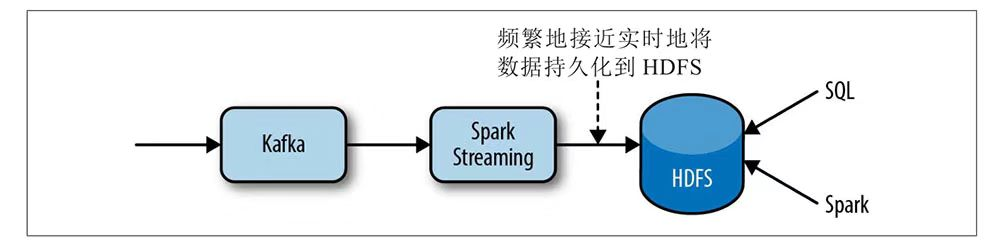
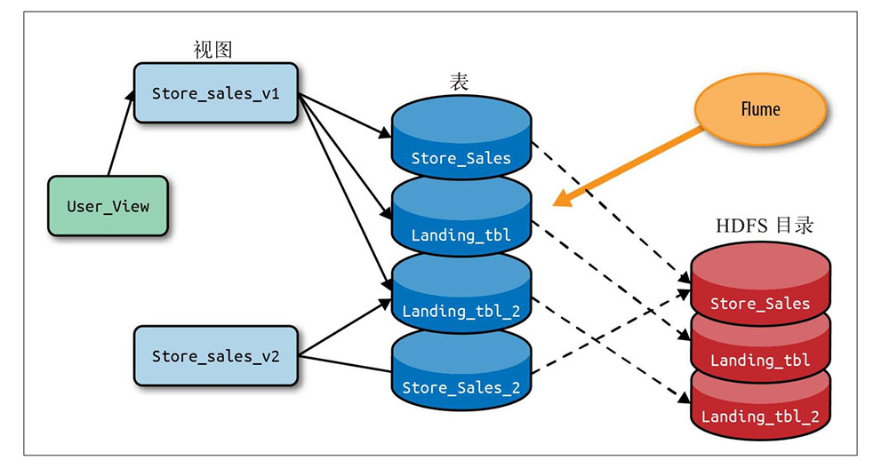
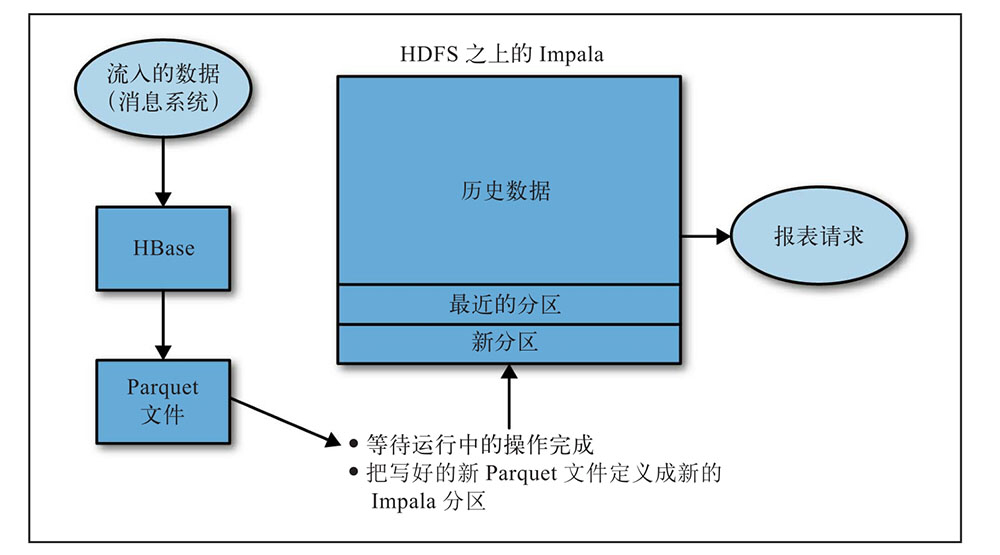
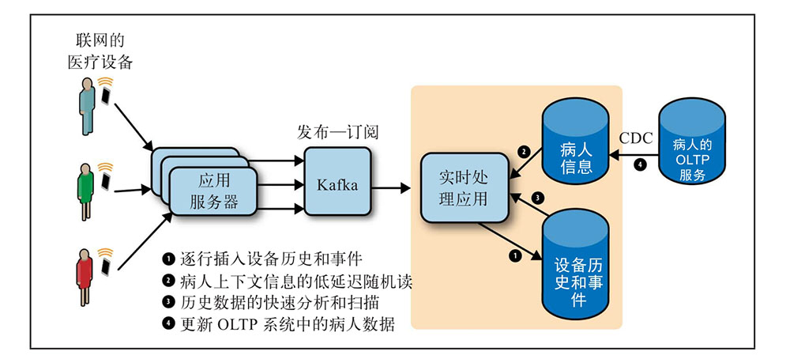

## Kudu

基本的访问模式：
- 查看当前系统的情况，比如更新了版本之后系统最近的业务状态，评估是否正常
- 分析，研究数据的趋势，用最新的结果做了解和报告

对存储层的要求：
- 逐行插入，能够立即可读
- 低延迟随机读。能够高效的访问一小部分数据
- 快速分析和扫描。满足报表和即席查询，需要能够高效的扫描大规模数据
- 更新。上下文信息会变化。

使用传统的存储引擎：
- 迭代1：HDFS。
    - 比如一个spark streaming每10s运行一次生成一个小批量数据存入HDFS【TODO：这个写是写入新文件还是追加？性能怎么样？】
    
    

- 迭代2：HDFS+compaction
    - 存在的问题以及复杂性
        - 需要在一个分区不在活跃时进行compaction过程，并且不能把结果覆盖到同一分区中。写入一个新的位置并通过HDFS命令交换新老位置，还不太能保证数据的一致性
        - HDFS没有主键概念，还需要一个可去重的机制
        - 有延迟的到达的数据可能不会落到当天的compaction分区内

- 迭代3：HBase+HDFS
    - HBase和Cassandra都属于big table家族，致命弱点是不能提供HDFS和Parquet的快速分析和扫描
    - 复杂，开发、维护、操作成本都很高，实际上很少用这种方案
    

分开来看，不使用kudu通过Hadoop生态也可以拥有上面的要求，其系统架构如下，不足是很复杂且难以维护

#### 学习资料
- 《Kudu:构建高性能实时数据分析存储系统》