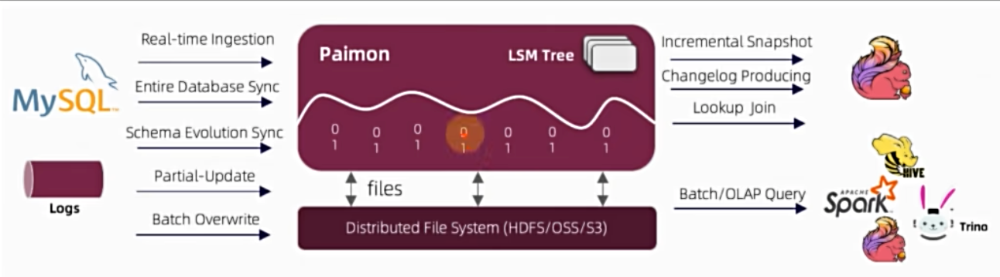

# Apache Paimon

流式数据湖平台，前身：Flink Table Store
- Streaming 实时计算能力和Lakehouse新架构优势
- 高速数据摄取（入湖）、变更日志追踪和高效的实时分析能力
- 统一存储（批流一体）

核心特点：
1. 统一批处理和流处理：批量写入和读取、流式更新、变更日志生产全部支持
2. 数据湖能力：低成本、高可靠、可扩展的元数据。具有数据湖存储的所有优势
3. 各种合并引擎：有多种保留最后一条记录的更新方式
4. 变更日志生产：可以从任何数据源生产正确且完整的变更日志，从而简化流分析
5. 丰富的表类型：主键表，还支持append-only表，提供有序的流式读取来代替消息队列
6. 模式演化（Schema变更）：支持完整的模式演化，可以重命名列并重新排序

基本概念
- Snapshot：快照捕获表在某个时间点的状态。通过时间旅行，还能访问到历史的状态
- 分区
- Bucket：
- 一致性保证 Consistency Guarantees