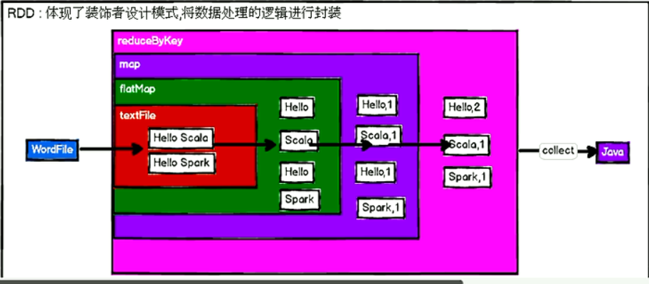

## RDD编程


JavaSparkContext是SparkContext的子类，针对java的SparkContext版本

SparkSession是一个统一的入口，可以直接调用SparkContext的方法，也可以执行SparkSQL相关的方法
```
SparkConfig conf = new SparkConfig()
JavaSparkContext sc = new JavaSparkContext(conf)
// 统一的入口比如
SparkSession spark = SparkSession.builder().setMaster().appName().config(conf).getOrCreate()
// 可以转为sc或者sqlContext
SQLContext sqlContext = spark.sqlContext();
SparkContext sc = spark.sparkContext();
```


### 1. RDD基础
RDD 体现了装饰者模式，将数据处理的逻辑进行封装



- 什么是RDD
    - RDD：对数据的抽象——**弹性分布式数据集**，代表一个不可变、可分区、元素可并行计算的集合。
    - 一个RDD被分为多个分区运行在不同节点上，可以包含python、java、scala中任意类型的对象，甚至是用户自定义对象。
    - 具有数据流模型的特点：自动容错、位置感知性调度和可伸缩性
    - 允许执行多个查询时显式的把工作集缓存在内存中
- RDD属性
    - 一组分区（Partition），即数据集的基本组成单位。这是逻辑上的分区，一个分区可能包含多个数据块
    - 一个计算每个分区的函数;
    - RDD之间的依赖关系;
    - 一个Partitioner，即RDD的分片函数;
    - 一个列表，存储存取每个Partition的优先位置（preferred location）
> 移动数据不如移动计算！【首选位置、优先位置】即：通过优先位置把任务优先分配过去，尽量避免网络IO
- 特点
    - 分区：这是逻辑上的概念，每个分区的数据是抽象存在的。（分区应该是记录着数据的起始位置）
    - 只读：对RDD的操作只能通过RDD转换算子进行
    - 依赖：一个RDD包含了从其他RDD衍生所必需的信息，RDD之间存在依赖。
        - 窄依赖：子RDD的分区与父RDD的分区一一对应
        - 宽依赖：子RDD的分区与父RDD的每个分区都有关，是多对多的关系
    - 缓存：RDD的执行是按照血缘关系延时计算的（可以通过持久化切断血缘）
    - checkpoint：将数据持久化到存储中，也就切断了血缘


#### 1.1 创建RDD
有两种方式：1. 读取外部数据集 2. 在驱动器程序中对一个集合进行并行化
```
# python
sc.parallelize(["hello", "spark"])
# java
JavaRDD<String> lines = sc.parallelize(Arrays.asList("hello", "spark"))
# scala 还有一个makeRDD函数
val x = sc.parallelize(List("hello", "spark-shell"))
val rdd1 = sc.makeRDD(Array(1,2,3,4,5))
``` 
#### 1.2  RDD操作
转化(transformation)操作
- 返回一个新的RDD，进行的是惰性求值（读取文件sc.textFile()也是惰性的）
- 可以操作任意数量的输入RDD，比如rdd1.union(rdd2)
- Spark会使用谱系图（lineage graph）来记录不同RDD之间的关系

类型 | 函数 | 说明 | 举例
--- | --- | --- | ---
Value类型 | map(func) | 对每个元素执行传入的方法，一对一 | rdd.map(_ * 2) // 所有元素乘以2
Value类型 | mapPartition(func) | func函数处理一整个分区的数据。即有n个分区，就调用func函数n次。 
Value类型 | mapPartitionWithIndex(func) |  
Value类型 | flatMap | 对每个元素执行传入的方法，一对多 | 把字符串切分为单词

Value类型 | filter | 过滤出符合条件的元素 
Value类型 | distinct | 去重，开销很大，需要通过网络把所有数据进行混洗
双Value类型 | union | 并集，合并前有重复的元素合并后也有 | rdd1.union(rdd2)
Value类型 | intersection | 交集，会去除重复的元素，单个RDD内的重复元素也会移除。性能较差，需要混洗 | 
Value类型 | subtract | 差集，有需要混洗 | 
Value类型 | cartesian | 笛卡尔积，在考虑所有组合的时候有用 |
Value类型 | sample  | 采样 | 参见 Main.testSample()

行动(action)操作
- 触发实际计算（一个action会触发一个job），向驱动器程序返回结果或者把结果写入外部系统
- 常用count()计数，take(num)取出数据，collect()获取整个RDD中的数据
- 当调用一个新的行动操作时，整个RDD都会从头开始计算。可以通过将中间结果持久化避免这种低效的行为
> collect()需要确保单台机器的内存放得下的时候才能使用

函数 | 说明 | 举例
--- | --- | ---
reduce | 操作RDD中的两个元素，返回一个同类型的新元素，有点类似于执行窗口为2的函数 | 累加 rdd.reduce((a, b) -> a + b)
fold | 跟reduce类似，只是多了个初始值，用作为每个分区第一次调用时的结果 | rdd.fold(100, (a, b) -> a + b))
aggregate(zeroValue, seqOp, combOp) | seqOp在每个分区执行map操作，combOp是把seqOP操作后的结果执行fold操作 | 求均值
countByValue() | 各元素在RDD中出现的次数 |
take(num) | 取num个元素
top(num) | 取前num个元素 | 
takeOrdered(num, ordering) | 按照指定规则排序后取前num个元素 | 
takeSample | 采样
foreach(func) | |

#### 1.3 向Spark传递函数
大部分转化操作和一部分行动操作都需要依赖用户传递的函数来计算。有几个注意的地方：
- python和Scala会把函数所在的对象也序列化传出去，应注意使用局部变量来避免 参见：[passFunction.py](https://github.com/fancyChuan/bigdata-learn/blob/master/spark/src/main/python/passFunction.py)
- 传递的函数中包含不能序列化的对象会报错

在java用于传递的函数需要实现org.apache.spark.api.java.function任一函数式接口
- 标准Java函数式接口

函数名 | 实现的方法 | 用途
--- | --- | ---
Function<T, R> | R call(T) | 接收1个输入返回一个输出，用于类似于map()和filter()等操作中
Function2<T1, T2, R> | R call(T1, T2) | 接收2个输入返回一个输出，用于类似于fold()和aggregate()等操作中
FlatMapFunction<T, R> | Iterator(R) call(T) | 接收一个输入返回任意多个输出，用于类似于flatMap()这样的操作

- 针对专门类型的函数接口

函数名 | 等价函数 | 用途
--- | --- | ---
DoubleFlatMapFunction<T> | Function<T, Iterator<Double>> | 用于rdd.flatMapToDouble()生成DoubleRDD
DoubleFunction<T> | Function<T, Double> | 用于rdd.mapToDouble()生成DoubleRDD
PairFlatMapFunction<T, K, V> | Function<T, Iterator<Tuple2<K, V>>> | 用于rdd.flatMapToPair()生成PairRDD<K,V>
PairMapFunction<T, K, V> | Function<T, Tuple2<K, V>> | 用于rdd.mapToPair()生成PairRDD<K,V>

#### 1.4 持久化（缓存）
- persist() 缓存，unpersist() 取消缓存
> cache是persist的一种简化方法，cache底层调用的是persist的无参方法，同时使用的MEMORY_ONLY模式
- 缓存级别： 类型定义在StorageLevel中

级别 | 含义解释
--- | ---
MEMORY_ONLY | 这是默认的持久化策略，使用cache()方法时，实际就是使用的这种持久化策略：使用未序列化的Java对象格式，将数据保存在内存中
MEMORY_ONLY_SER | 含义同MEMORY_ONLY，只是会对RDD中的数据进行序列化，更省内存，能避免频繁GC
MEMORY_AND_DISK | 内存存不下则溢写到磁盘
MEMORY_AND_DISK_SER | 内存存不下则溢写到磁盘，进行序列化
DISK_ONLY | 只放在磁盘
> 在存储级别后面加个 "_2" 可以把持久化数据存为两份

#### 1.5 键值对操作
PairRDD 键值对RDD，元素为Java或Scala中的Tuple2对象或者python中的元组
> Tuple2对象可以通过 _1  _2 来访问元素
创建PairRDD，有两种方式：
- 并行化初始化：Java使用sc.parallelizePairs() python可以直接使用sc.parallelize()
- 从其他RDD转化而来: rdd.mapToPair() python直接rdd.map()
> 注意在Java中没有二元组类型，需要使用scala.Tuple2()来创建

##### PairRDD的转化操作
函数名 | 作用
--- | ---
reduceByKey | 把相同的key汇总到一起进行reduce操作
groupByKey | 把相同key的value分组
combineByKey | 基于key进行聚合，功能特点跟aggregate很像
mapValues | 只对value执行操作
flatMapValues | 只对value操作，跟flatMap类似
keys() | 返回仅包含key的RDD
values() | 返回仅包含value的RDD
sortByKey() | 对元素按key排序
rdd1.subtractByKey(rdd2) | 删掉rdd1中与rdd2的key相同的元素
rdd1.join(rdd2) | 内连接
rdd1.rightOutJoin(rdd2) | 右外连接
rdd1.leftOutJoin(rdd2) | 左外连接
rdd1.cogroup(rdd2) | 将两个RDD具有相同key的value分组到一起

combineByKey(createCombiner, mergeValue, mergeCombiners, partitioner) 执行细节
- 执行过程
    - combineByKey() 会遍历分区中的所有数据
    - 在每个分区一旦遇到新元素，就会调用createCombiner() 函数来创建key所对应的累加器的初始值
    - 在分区中已经遇到过的元素，调用mergeValue() 把累加器对应的值合并
    - 对于存在多个分区的相同的key，调用mergeCombiners()方法合并各个分区的结果
- combinerByKey有多个参数对应聚合操作的各个阶段，非常适合用来解析聚合操作各个阶段的功能划分
- 最后一个参数指定分区数 
> 很多基于键的数据合并函数大部分都是在combineByKey()的基础上实现的，在spark上使用这些专用的聚合函数始终要比手动将数据分组再规约快很多

并行度调优
- 每个RDD都有固定的分区数，决定了RDD执行时的并行度
- 大部分操作符都能接受一个指定分区数的参数，比如reduceByKey(func, parititions)
> 自定义分区的方式：
> 1. 创建RDD时指定分区数，不指定的话，跟集群环境有关。比如本地运行spark时 local[3] 就是3个分区。比如 sc.parallelize(...., 3) 指定了三个分区，不加3则是默认分区数
> 2. 修改原有的RDD分区，通过coalesce(),repartition()也可以，只是性能比coalesce()差

##### PairRDD的行动操作
函数名 | 说明
--- | ---
countByKey() | 对key计数
collectAsMap() | 将RDD结果转为Map格式
lookup(key) | 查找键为key的元素
 
 
### 2. 数据分区
#### 2.1 能从分区中获益的操作： 
- cogroup() groupWith() join() leftOuterJoin() groupByKey() reduceByKey() combineByKey() lookup()
- 对于像join() cogroup() 这样的二元操作，预先进行分区能让至少一个RDD不发生数据混洗

#### 2.2 影响分区方式的操作：
- map() 操作所接受的函数理论上可以改变元素的键，其运行的结果不会有固定的分区方式。作为替换，mapValues() flatMapValues()可以保证键保持不变，分区也就不变
- 所有会为结果RDD设置好分区的操作：
    - cogroup() groupWith() join() leftOuterJoin() rightOuterJoin() 
    - groupByKey() reduceByKey() combineByKey() 
    - lookup() partitionBy() sort() 
    - 如果父RDD有分区方式的话： mapValues() filter()

对于二元操作，结果RDD的分区方式取决于父RDD。当两个父RDD都有分区方式时取决于第一个，否则取决于有分区方式的那个。默认是使用哈希分区，分区的数量与操作的并行度一样。

#### 2.3 自定义分区方式
Spark提供HashPartitioner和RangePartitioner，同时允许自定义Partitioner对象，可以让用户利用领域知识进一步减少通信开销。

实现：继承org.apache.spark.Partitioner并实现三个方法
- numPartitions： 返回创建的分区数
- getPartition： 返回给定key的分区编号
- equals：很重要，Spark需要用这个方法来判断分区器对象是否和其他分区器实例相同，这样Spark才能判断两个RDD的分区方式是否相同
> 注意：若算法依赖java的hashCode()，这个方法可能会返回负数，需要确保getPartition()永远返回一个非负数


### 3. 数据的读取与保存

spark支持的一些常见的格式
- 文件文件
    - sc.textFile()
    - sc.wholeTextFiles()
        -  得到一个PairRDD，文件名为key，整个文件内容为value
        - wholeTextFiles对于大量的小文件效率比较高，大文件效果没有那么高
        - 一些文件系统的路径名采用通配符的形式效果比一个一个文件名添加上去更高效
    - saveAsTextFile()，spark将传入的路径作为目录对待
- JSON
    - 注意是否有跨行json
    - 如果构建json解析器的开销比较大，那么可以使用mapPartitions()来重用解析器
    - 对于大规模数据，格式错误是家常便饭，一般会跳过解析出错的数据，但需要使用累加器跟踪错误的个数
    - 性能还不错，使用比较简单的常用库： python使用自带的json，而Java和Scala则使用Jackson
- CSV
    - 不支持嵌套字段，需要手动组合和分解特定的字段
    - 使用的库：python自带的csv，java、scala使用opencsv库（hadoop的CSVInputFormat也可以读取，只不过不支持换行符）
    
- SequenceFile 用于键值对数据的常见Hadoop文件格式
    - 由没有对象关系结构的键值对文件组成
- Protocol buffers 快速节约空间的跨语言格式
- 对象文件 用来将Spark作业中的数据存储下来以让共享的代码读取。改变类的时候会它会失效，因为依赖于java序列化
    - 看起来像是SequenceFile的简单封装，允许只包含值的RDD
    - 用java序列化写出（和SequenceFile不一样），有可能相当慢
    - objectFile() saveAsObjectFile()
    - 在python中无法使用，作为代替使用：saveAsPickleFile() pickleFile()

文件压缩

文件系统
- 本地/“常规”文件系统
- HDFS

SparkSQL中的结构化数据
- Hive，需要安装配置好hive，然后把hive-site.xml放到spark的conf目录下
- JSON，不需要安装好hive


### 4. Spark编程进阶
#### 4.1 共享变量
> 默认情况下，一个算子函数使用到了某个外部变量，那么这个变量的值就会被copy到每个task中，此时每个task只操作自己的那份变量副本。多个task想共享某个变量用默认的方式是做不到的

两种类型的共享变量：累加器（accumulator）与广播变量（broadcast variable）
> 广播变量，仅仅为每个节点copy一份，而不是每个task；是共享读变量，不可修改。累加器可以让多个task共同操作一份变量
- 累加器用来对信息进行计数
    - Accumulator是存在Driver端的，从节点不断的把值传到Driver端，由Driver端完成计数
        - 从节点是读取不到的
        - SparkUI是在SparkContext创建时在Driver端被创建的，因此SparkUI可以读取
    - 用法： sc.accumulator(initnum)
    - 累加器与容错性
        - Spark 会自动重新执行失败的或较慢的任务来应对有错误的或者比较慢的机器，导致同一函数可能对同一数据加工多次
        - 对于在行动函数中使用的累加器，为了绝对可靠，我们必须把它放在foreach()这样的行动函数中
        - 转化操作中的累加器最好只在调试时使用，因为转化操作中的累加器可能不知发生一次更新（比如被缓存的RDD被移除后又重新使用到时就会重新计算，导致累加器也会更新）
    - 自定义累加器
        - Spark 还直接支持Double、Long 和Float 型的累加器，也引入了自定义累加器和聚合操作的API（比如找到最大值而不是累加）
        - 2.0版本后spark提供了一个新的抽象类：
    - CollectionAccumulator可以以集合的形式收集spark应用执行过程中的一些信息。（因为数据最终是发送回driver端的要注意控制收集信息的规模）
- 广播变量用来高效分发**较大的只读对象**
    - 作用： 减少变量到各个节点的网络传输消耗；减少在各个节点上的内存消耗
    - 类型为：spark.broadcast.Broadcast[T]。通过sc.broadcast(rdd) 可以将一个rdd变为广播变量
    - 场景：向所有节点发送一个较大的只读查询表，ML算法中的特征等。仅在跨多个stage的任务需要相同数据或者反序列化格式缓存数据很重要时才有用
    - Spark 会自动把闭包中所有引用到的变量发送到工作节点上，虽方便但低效
        - 默认的任务发送机制针对小任务优化
        - 事实上可能会在多个并行操作中使用同一个变量，但Spark会为每个操作分别发送
    - 广播变量只会被发送一次，在程序中通过调用value来获取广播变量的值
    - “只读”的要求：
        - 一般只使用广播变量值，或者把变量设置为不可变对象（final、val）
        - 在工作节点上修改该广播变量的值时，只对当前工作节点有效，不会影响到其他工作节点，因为只分发一次
    - 广播的优化
        - 可以使用spark.serializer属性来选择更高效的序列化库，比如Kryo
>TODO：多stage中广播变量，是显式广播了之后，后续的所有stage都不需要再次广播了吧


#### 4.2 基于分区的操作
- 基于分区对数据进行操作可以让我们避免为每个数据元素进行重复的配置工作（如打开数据库连接或创建随机数生成器等）
- 主要方法有：map/foreach
- 按分区执行的操作符

函数名 | 调用所提供的 | 返回的  | 好处特点
--- | --- | --- | ---
mapPartitions | 输入RDD的每个分区中的元素迭代器 | 返回元素的迭代器 | 避免创建对象的开销
mapPartitionsWithIndex | 分区序号，以及分区中元素的迭代器 | 返回元素的迭代器
forEachPartitions | 元素迭代器 | 无

#### 4.3 与外部程序间的管道
Spark提供pipe()函数，可以把RDD的元素从Unix标准流中输出，允许用户使用任意语言实现处理逻辑


#### 4.4 数值RDD的操作

StatsCounter中可用的汇总统计数据
方法 | 含义
--- | ---
count() | RDD 中的元素个数
mean() | 元素的平均值
sum() | 总和
max() | 最大值
min() | 最小值
variance() | 元素的方差
sampleVariance() | 从采样中计算出的方差
stdev() | 标准差
sampleStdev() | 采样的标准差