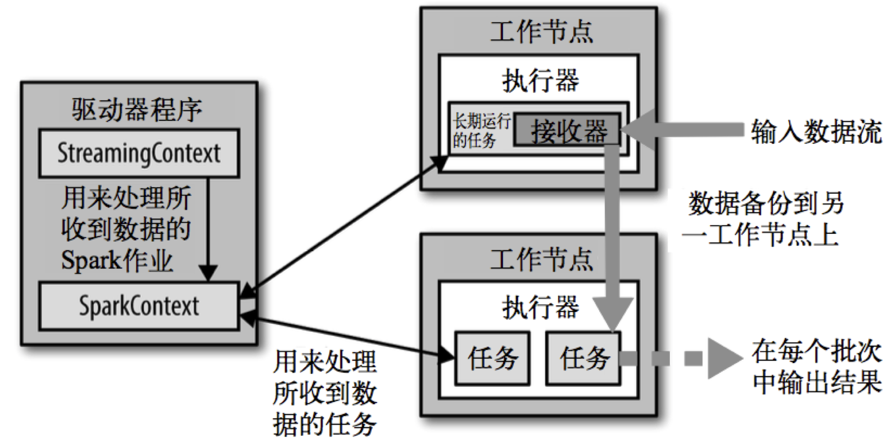

## Spark Streaming

SparkStreaming 架构


常见批处理方式：
- 单独处理每条记录，并在记录出现时立刻处理；
- 把多个记录组合为小批量任务，可以通过记录数量或者时间长度切分出来。spark streaming采用这种方式，核心概念是 **离散化流(DStream)**

与批处理不同，流处理应用需要保证不间断运行，需要的支持：
- checkpointing机制：把数据存到可靠文件系统（如HDFS）上
- 自动重启模式


转化操作：
- 无状态的操作
- 有状态的操作， 需要checkpointing机制来确保
    - 基于窗口的转化操作
    - UpdateStateByKey转化操作

#### 背压机制
1.5版本以前，通过静态配制参数spark.streaming.receiver.maxRate的值来限制 Receiver 的数据接收速率，

不足：producer数据生产高于maxRate，当前集群处理能力也高于maxRate，这就会造成资源利用率下降等问题

为了更好的协调数据接收速率与资源处理能力，1.5版本开始 Spark Streaming 可以动态控制数据接收速率来适配集群数据处理能力

背压机制（即Spark Streaming Backpressure）: 根据 JobScheduler 反馈作业的执行信息来动态调整 Receiver 数据接收率
```
spark.streaming.backpressure.enabled
# 默认是false，也就是不开启背压机制
```

SparkStreaming版本的WordCount：[StreamingWordCountApp.scala](spark2.4.4/src/main/scala/cn/fancychuan/scala/wordcount/StreamingWordCountApp.scala)