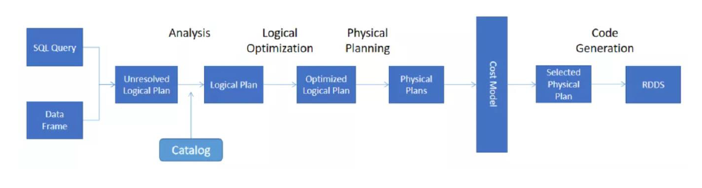

## 执行计划
从 3.0 开始， explain 方法有一个新的参数 mode ，该参数可以指定 执行计划展示格式：
- explain(mode= simple ""))：只展示物理执行计划。
- explain(mode= extended ""))：展示物理执行计划和逻辑执行计划。
- explain(mode= codegen "") ：展示要 Codegen 生成的可执行 Java 代码。
- explain(mode= cost ""))：展示优化后的逻辑执行计划以及相关的统计。
- explain(mode= formatted ""))：以分隔的方式输出，它会输出更易读的物 理执行计划， 并展示每个节点的详细信息。

执行计划处理流程：

核心分为5个步骤：
- 分析
- 逻辑优化
- 生成物理执行计划
- 评估模型分析
- 代码生成

