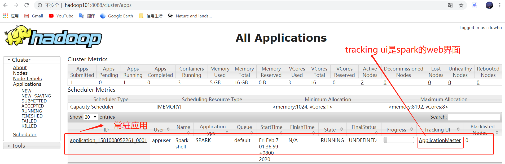

## spark


### spark-shell
启动的时候会创建igeSparkContext和SparkSession的实例，分别为sc/spark，可以直接使用
- spark-shell版本的wordcount
```
# 使用本地文件系统
sc.textFile("file:///home/appuser/zookeeper.out").flatMap(_.split(" ")).map((_, 1)).reduceByKey(_ + _).collect()
# 使用hdfs文件系统
sc.textFile("hdfs://hadoop101:9000/user/appuser/mapreduce/input").flatMap(_.split(" ")).map((_, 1)).reduceByKey(_ + _).collect()
# 下面这行语句也可以执行是因为spark默认是使用的hdfs
sc.textFile("/user/appuser/mapreduce/input").flatMap(_.split(" ")).map((_, 1)).reduceByKey(_ + _).collect() 
```
> 上面的同一个语句指定第二次的时候只需要53ms，而第一次是0.3s，应该是有缓存

- master参数的作用
```
# 1.直接执行spark-shell，默认使用的时候local模式，也就是相当于
spark-shell --master local[*]

# 2.使用yarn模式。
spark-shell --master yarn
这个时候在yarn上会产生一个常驻yarn application。查看4040端口会跳转到yarn的8088界面。
即 http://hadoop101:4040 重定向到 http://hadoop101:8088/proxy/application_1581008052261_0001/
# 3.standalone模式
spark-shell --master spark://host:port, 
# 4.其他mesos://host:port, yarn, k8s://https://host:port, or local (Default: local[*]).
```



- deploy-mode参数，默认是client，这里不能用cluster，因为集群模式不支持spark-shell

spark-shell的所有参数如下
```
  --master MASTER_URL         spark://host:port, mesos://host:port, yarn,
                              k8s://https://host:port, or local (Default: local[*]).
  --deploy-mode DEPLOY_MODE   Whether to launch the driver program locally ("client") or
                              on one of the worker machines inside the cluster ("cluster")
                              (Default: client).
  --class CLASS_NAME          Your application's main class (for Java / Scala apps).
  --name NAME                 A name of your application.
  --jars JARS                 Comma-separated list of jars to include on the driver
                              and executor classpaths.
  --packages                  Comma-separated list of maven coordinates of jars to include
                              on the driver and executor classpaths. Will search the local
                              maven repo, then maven central and any additional remote
                              repositories given by --repositories. The format for the
                              coordinates should be groupId:artifactId:version.
  --exclude-packages          Comma-separated list of groupId:artifactId, to exclude while
                              resolving the dependencies provided in --packages to avoid
                              dependency conflicts.
  --repositories              Comma-separated list of additional remote repositories to
                              search for the maven coordinates given with --packages.
  --py-files PY_FILES         Comma-separated list of .zip, .egg, or .py files to place
                              on the PYTHONPATH for Python apps.
  --files FILES               Comma-separated list of files to be placed in the working
                              directory of each executor. File paths of these files
                              in executors can be accessed via SparkFiles.get(fileName).

  --conf PROP=VALUE           Arbitrary Spark configuration property.
  --properties-file FILE      Path to a file from which to load extra properties. If not
                              specified, this will look for conf/spark-defaults.conf.

  --driver-memory MEM         Memory for driver (e.g. 1000M, 2G) (Default: 1024M).
  --driver-java-options       Extra Java options to pass to the driver.
  --driver-library-path       Extra library path entries to pass to the driver.
  --driver-class-path         Extra class path entries to pass to the driver. Note that
                              jars added with --jars are automatically included in the
                              classpath.

  --executor-memory MEM       Memory per executor (e.g. 1000M, 2G) (Default: 1G).

  --proxy-user NAME           User to impersonate when submitting the application.
                              This argument does not work with --principal / --keytab.

  --help, -h                  Show this help message and exit.
  --verbose, -v               Print additional debug output.
  --version,                  Print the version of current Spark.

 Cluster deploy mode only:
  --driver-cores NUM          Number of cores used by the driver, only in cluster mode
                              (Default: 1).

 Spark standalone or Mesos with cluster deploy mode only:
  --supervise                 If given, restarts the driver on failure.
  --kill SUBMISSION_ID        If given, kills the driver specified.
  --status SUBMISSION_ID      If given, requests the status of the driver specified.

 Spark standalone and Mesos only:
  --total-executor-cores NUM  Total cores for all executors.

 Spark standalone and YARN only:
  --executor-cores NUM        Number of cores per executor. (Default: 1 in YARN mode,
                              or all available cores on the worker in standalone mode)

 YARN-only:
  --queue QUEUE_NAME          The YARN queue to submit to (Default: "default").
  --num-executors NUM         Number of executors to launch (Default: 2).
                              If dynamic allocation is enabled, the initial number of
                              executors will be at least NUM.
  --archives ARCHIVES         Comma separated list of archives to be extracted into the
                              working directory of each executor.
  --principal PRINCIPAL       Principal to be used to login to KDC, while running on
                              secure HDFS.
  --keytab KEYTAB             The full path to the file that contains the keytab for the
                              principal specified above. This keytab will be copied to
                              the node running the Application Master via the Secure
                              Distributed Cache, for renewing the login tickets and the
                              delegation tokens periodically.
```