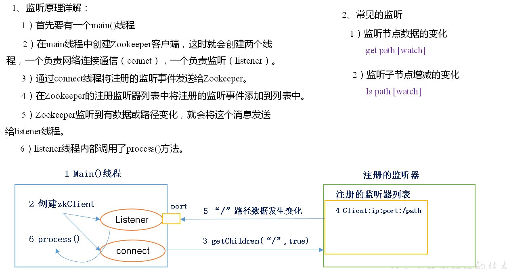

## ZooKeeper内部原理

#### 节点类型
- 持久节点、临时节点
- 有序节点、无序节点

> 在分布式系统中，顺序号可以被用于为所有的事件进行全局排序，这样客户端可以通过顺序号来推断事件的顺序

#### 监听器原理


#### Paxos算法(拓展)
这是一种基于消息传递且具有高度容错特性的一致性算法

分布式系统中的节点通信存在两种模型：
- 共享内存（Shared memory）
- 消息传递（Messages passing）
    - 可能存在的错误场景：进程可能会慢、被杀死或者重启，消息可能会延迟、丢失、重复

```
Paxos算法流程中的每条消息描述如下：
1.	Prepare: Proposer生成全局唯一且递增的Proposal ID (可使用时间戳加Server ID)，向所有Acceptors发送Prepare请求，这里无需携带提案内容，只携带Proposal ID即可。
2.	Promise: Acceptors收到Prepare请求后，做出“两个承诺，一个应答”。
两个承诺：
a.	不再接受Proposal ID小于等于（注意：这里是<= ）当前请求的Prepare请求。
b.	不再接受Proposal ID小于（注意：这里是< ）当前请求的Propose请求。
一个应答：
c.	不违背以前做出的承诺下，回复已经Accept过的提案中Proposal ID最大的那个提案的Value和Proposal ID，没有则返回空值。
3.	Propose: Proposer 收到多数Acceptors的Promise应答后，从应答中选择Proposal ID最大的提案的Value，作为本次要发起的提案。如果所有应答的提案Value均为空值，则可以自己随意决定提案Value。然后携带当前Proposal ID，向所有Acceptors发送Propose请求。
4.	Accept: Acceptor收到Propose请求后，在不违背自己之前做出的承诺下，接受并持久化当前Proposal ID和提案Value。
5.	Learn: Proposer收到多数Acceptors的Accept后，决议形成，将形成的决议发送给所有Learners。

```


#### 选举机制
半数机制：集群中半数以上机器存活，集群可用。所以Zookeeper适合安装奇数台服务器

zk的状态：looking、follower、leader。处于looking状态的节点是不能对外提供服务的

能力强弱的比较规则：
- 优先比较事务id，也就是zxid
- zxid相同的比较节点ID，也就是mid

假设有5台服务器，都是最新启动的（没有历史数据，或者存的历史数据都一致）
- （1）服务器1启动，发起一次选举。服务器1投自己一票。此时服务器1票数一票，不够半数以上（3票），选举无法完成，服务器1状态保持为LOOKING；
- （2）服务器2启动，再发起一次选举。服务器1和2分别投自己一票并交换选票信息：此时服务器1发现服务器2的ID比自己目前投票推举的（服务器1）大，更改选票为推举服务器2。此时服务器1票数0票，服务器2票数2票，没有半数以上结果，选举无法完成，服务器1，2状态保持LOOKING
- （3）服务器3启动，发起一次选举。此时服务器1和2都会更改选票为服务器3。此次投票结果：服务器1为0票，服务器2为0票，服务器3为3票。此时服务器3的票数已经超过半数，服务器3当选Leader。服务器1，2更改状态为FOLLOWING，服务器3更改状态为LEADING；
- （4）服务器4启动，发起一次选举。此时服务器1，2，3已经不是LOOKING状态，不会更改选票信息。交换选票信息结果：服务器3为3票，服务器4为1票。此时服务器4服从多数，更改选票信息为服务器3，并更改状态为FOLLOWING；
- （5）服务器5启动，同4一样当小弟

Observer使用的场景：
- zk集群非常大，这个时候就用其中的几台形成follower和leader的投票小集群，其他为Observer（只执行写操作，不参与投票）
- 跨机房DC的zk集群需要同步

#### 写数据流程
- server收到写请求的时候会把消息转发给leader
- leader向所有follower广播，每个follower会把消息加入待写队列，并向leader发送成功信息
- 超过半数成功后，说明写操作可以进行，leader就告诉follower开始执行写的动作


> Kafka旧版本把offset放到zk里面，但是后面移出来了，主要是因为zk在高并发读写场景下性能跟不上。主要是因为投票和预提交的机制