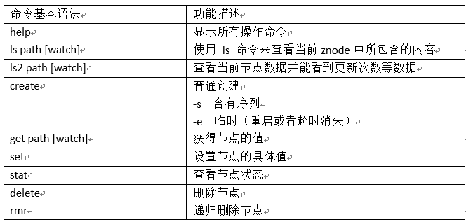

## ZooKeeper操作命令和API

### 操作命令

### API

- 创建组
- 加入组
    - 每个组成员作为一个程序运行
    - 当程序退出时，组成员应当从组中删除
    - 通过在ZooKeeper的命名空间中使用短暂znode来代表一个组成员
- 列出组成员
- 删除组
    - zookeeper不支持递归的删除操作，在删除父节点之前需要先删除子节点
    - delete需要提供两个参数：节点路径+版本号。一致才会删除，版本号设为-1的时候，会直接删除

