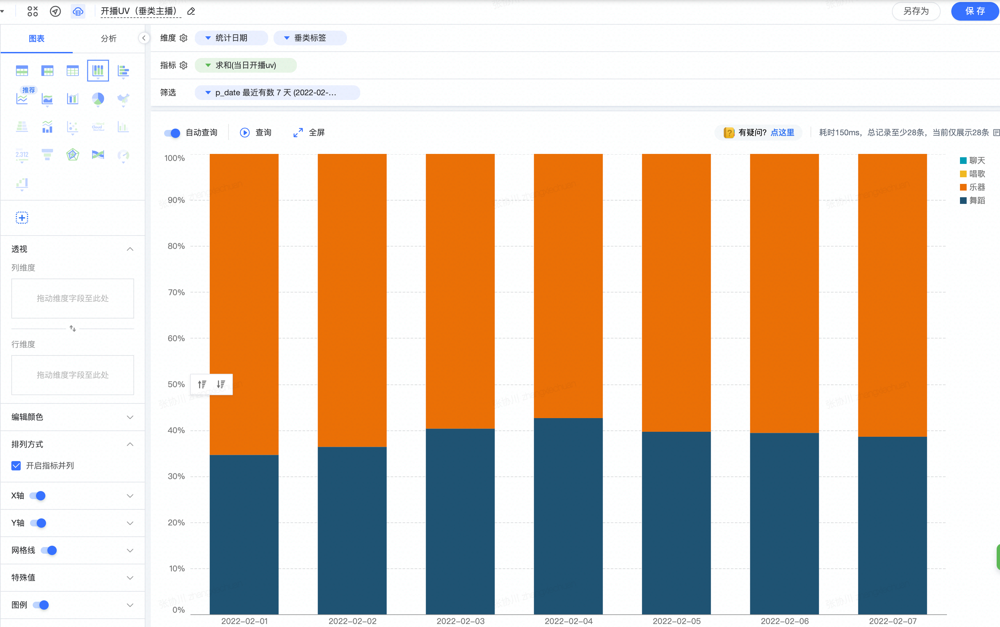
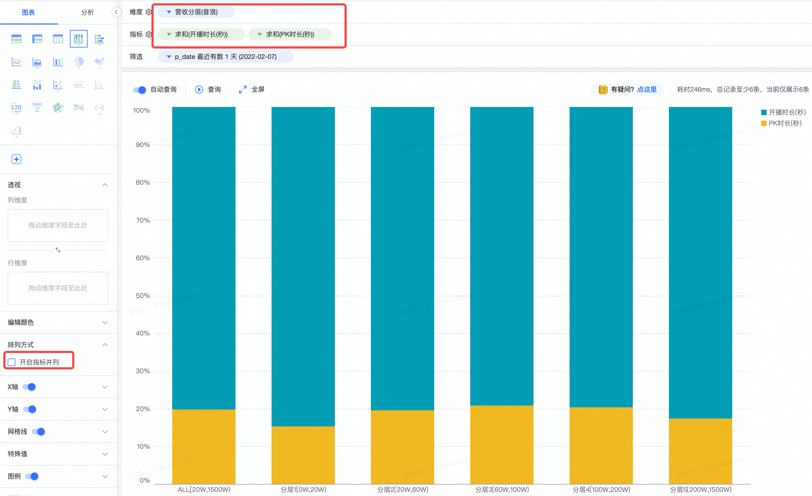

## 可视化类型

### 1. 可视化组件

##### 百分比柱状图（堆叠）
使用场景：
- 按时间看每天堆叠百分比的变化情况：这个时候时间是作为维度的（维度：还可以进一步细分为列维度、行维度）

- 看某一维度下，多个指标的占比情况

#### 1.1 透视驱动类型

#### 1.2 图标驱动类型

### 2. 可视化应用

#### 2.1 仪表盘（dashboard）

#### 2.2 大屏管理（Display）

### 3. 可视化交互
功能：钻取、联动、分享、过滤器、控制器、视频、自由布局