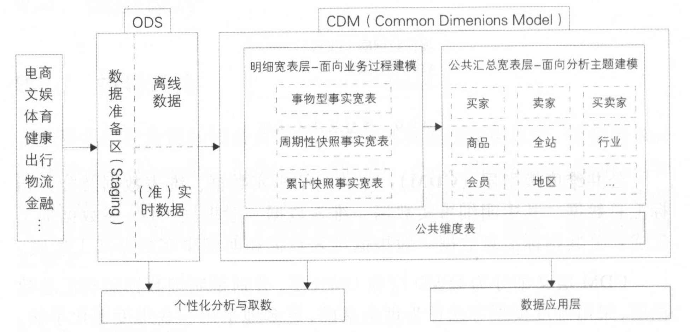

# 阿里巴巴数据整合及管理体系
构建阿里巴巴的数据公共层：统一、规范、可共享的全域数据体系

## 9.1 概述
建设方法论的核心：从业务架构设计到模型设计，从数据研发到数据服务，做到
- 数据可管理
- 数据可追溯
- 可规避重复建设

## 9.2 规范定义

- 事务性指标和存量型指标一般只会唯一定位到一个业务过程，如果遇到同时有两个行为发生、需要多个修饰词、生成一个派生指标的情况，则
    - 选择时间靠后的行为创建原子指标，
    - 选择时间靠前的行为创建修饰词。
- 原子指标必须挂靠在某个业务过程下
- 衍生指标
    - 事务性指标：对业务活动进行衡量的指标。如：订单支付金额，需要维护原子指标和修饰词
    - 存量型指标：是指实体对象某些状态的统计。如：注册会员总数
    - 复合型指标：在事务性指标和存量型指标的基础上复合而成的。如：看播uv-打赏转化率
        - 有些需要创建原子指标，有些则可以在事务性原子指标的基础上增加修饰词得到
        - 规则：
            - 比率型：创建原子指标，比如满意率，转化率
            - 比例型：创建原子指标，比如 近1天舞蹈主播营收大盘占比。 原子指标“营收大盘占比”，修饰类型“垂类团队”，修饰词“舞蹈”
            - 变化量型：不创建原子指标，增加修饰词。比如 “近1天舞蹈主播上一天营收增量”，原子指标为“营收音浪” ，修饰类型为“统计方法”，修饰词为“上1天增量”
            - 变量率型：创建原子指标。如“近7天华北公会营收上7天变化率” 原子指标为“营收变化率”，修饰类型为“区域公会”，修饰词为“华北”
            - 统计性（均值，分位数等）：不创建原子指标，增加修饰词，在此基础上派生。“自然周日均开播uv”  修饰类型“统计方法” 修饰词“日均”
            - 排名型：创建原子指标，一般为top_xxx_xxx，有时会同时选择rank和top_xxx组合使用。修饰词有
                - 统计方法（如降序、升序等）
                - 排名名次（如top10）
                - 排名范围（如一级来源）
                - 排序依据（如pv）
            - 对象集合型：如top排名对象，修饰词同上
    - 其他规则：
        - 上下层级派生指标同时存在时，使用上一级
        >  如： 抖火大盘营收金额 和 抖音端营收金额，将抖音端作为维度属性
        - 父子关系原子指标存在时，衍生指标使用子原子指标。 Pv 和 IPV（商品详情页PV）

## 9.3 模型设计 
### 9.3.2 模型层次

CDM层：DWD+DWS
- 采用维度模型方法作为理论基础 ，更多地采用一些些维度退化手法，将维度退化至事实表中，减少事实表和维表的关联，提高明细数据表的易用性
- 同时在汇总数据层，加强指标的维度退化，采取更多的**宽表化**手段构建公共指标数据层，提升公共指标的复用性，减少重复加工

> DWD：面向业务过程建模    
> DWS：面向分析主题建模

应用数据层（ADS）
- 个性化指标加工：不公用性、复杂性（指数型、比值型、排名型指标）
- 基于应用的数据组装：大宽表集市、横表转纵表、**趋势指标串？**
> 指标串：我理解是把相关性的指标放到一起来看，比如成交额-下单量-点击量-曝光量

## 9.4 模型实施

#### 其他模型实施过程
不涉及具体的模型表达
- 业务建模，生成业务模型，主要解决业务层面的分解和程序化
- 领域建模，生成领域模型，主要对业务模型进行抽象处理，生成领域概念模型
- 逻辑建模，生成逻辑模型，主要是将领域模型的概念实体以及 实 体之间的关系进行数据库层次的逻辑化。
- 物理建模，生成物理模型，主要解决逻辑模型针对不同关系数据 库的物理化以及性能等一些些具体的技术问题

### OneData实施过程
