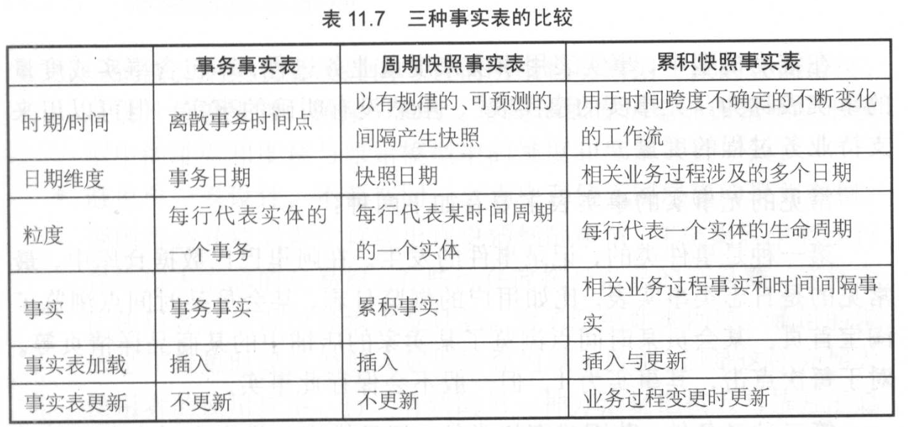

# 事实表设计

事实表设计的目的是为了度量 业务过程

设计原则：
- 尽可能包含所有与业务过程相关的事实
- 只选择与业务过程相关的事实
- 分解不可加事实为可加的组件
> 比如优惠率，分解成原价金额、优惠金额两个字段
- 在选择维度和事实之前必须先声明粒度
- 同一个事实表中不能有多重不同粒度的事实
- 事实的单位要保持一致
- 对事实的null值要处理
- 使用退化维度提高事实表的易用性

## 11.2 事务事实表

### 11.2.2 单事务事实表

### 11.2.3 多事务事实表

### 11.2.6 事实的设计准则
1. 事实完整性
2. 事实一致性
3. 事实可加性

## 11.3 周期快照事实表

### 11.3.2 实例
1. 单维度的每天快照事实表
2. 混合维度的每天快照事实表
3. 全量快照事实表

### 11.3.3 注意事项
1.事务和快照成对设计
2.附加事实
3.周期到日期度量

## 11.4 累积快照事实表
一般用于研究事件之间时间间隔的需求

### 11.4.2 特点
1. 数据不断更新
2. 多业务过程日期

### 11.4.3 特殊处理
1. 非线性过程
2. 多源过程
3. 业务过程取舍

## 11.5 三种事实表的比较

## 11.6 无事实的事实表

## 11.7 聚集型事实表

