## 数据湖公开课

数仓缺点：
- 没有非结构化数据
- 没有保留原始的数据

数据湖是一种思想，一种数据治理的方法

数据理念：
- 能够存储海量的原始数据
- 能够支持任意的数据格式
- 有较好的分析和处理能力

读时模式
- 读的时候再定义scheme

写时模式
- 写的时候就定义好scheme

离线数仓的痛点：
- TB级数据跑批失败，重跑资源浪费
- 写时模式，字段变更麻烦

实时数仓痛点：
- 无分层，没有中间加工逻辑，直接入库
- 多分层，中间结果基于MQ，深度加工入库

Lambda架构痛点
- 两套架构，数据merge成本高

实时数仓的演进：
- 借助数据湖的思想演进实时数仓
- 特点：多分层，中间结果基于数据湖，深度加工入库

助力企业数据中台架构升级：
- 1.目标：
    - 底层存储标准统一化
    - 构建实时化标准层，去T+1，保证时效性
    - 数据存储更安全，更全面，可回溯性更便捷，运维成本更低
- 2.数仓架构现状

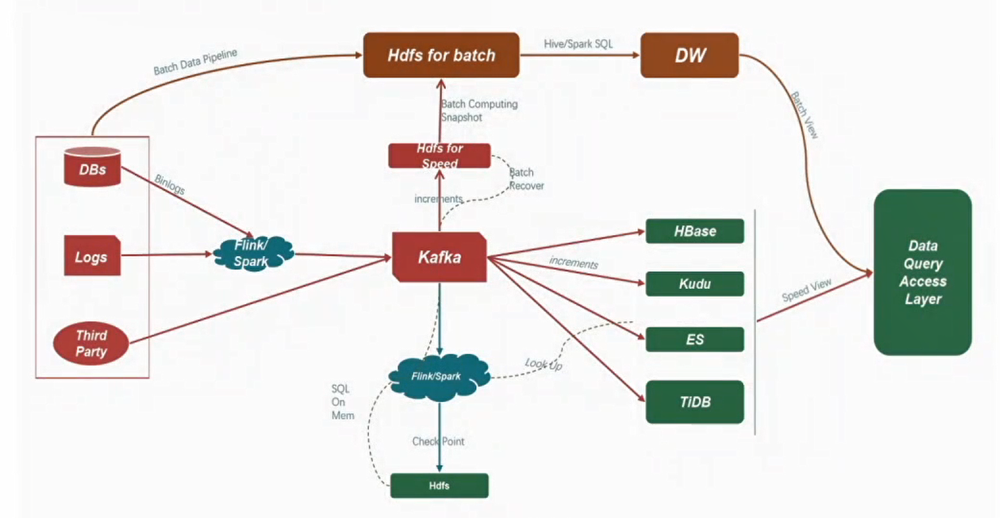
- 3.架构升级：数据在湖，模型在仓

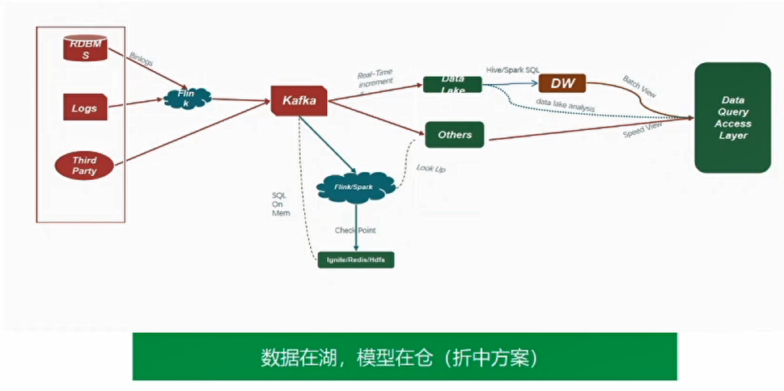
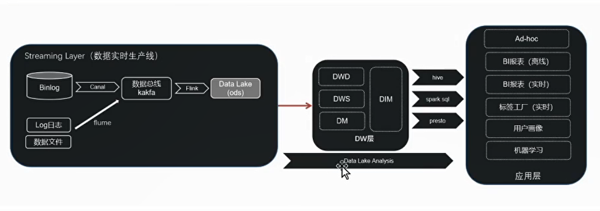

- 4.大数据中台实时数据建设要求：小时/天级别到分钟/秒级别
    - 高效的upsert操作
    - 高效的回溯能力
    - 支持schema变更
    - 支持ACID语义
    - 支持Flink写操作
    - 支持小文件压缩合并 
    
### 基于Hudi构建企业级数据湖
三种开源数据湖技术对比
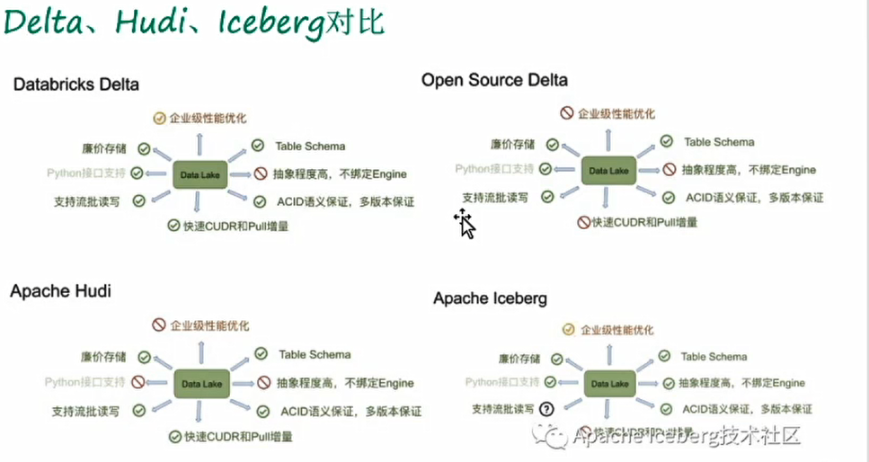

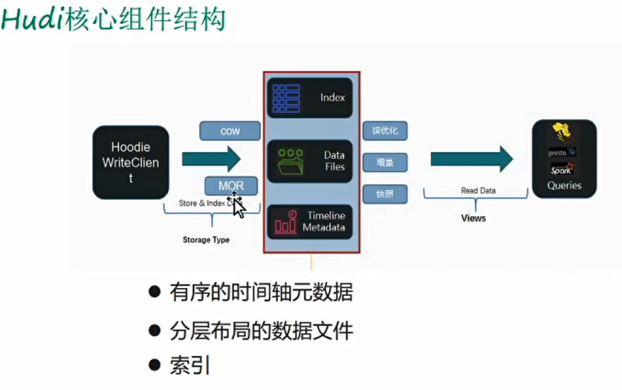
- COW：copy on write 写时复制（也就是读写分离）
- MOR：merge on read 读时合并

Hudi原语：
- upsert/delete记录
    - 使用细粒度的文件/记录级别索引来支持
    - 提供些操作的事务保证
- 变更流
    - 可以获取对数据的所有操作的增量流
    - 可以把Hudi当做kafka用

Hudi表设计
- 时间
    - 数据到达hudi时间
    - 数据提交时间：commit time
    - 事件时间：event time
- 有序的时间轴元数据（支持数据回溯）
- 数据文件
    - 使用parquet
- Hoodie Key：唯一字段+数据所在分区联合作为数据的唯一键
- 索引
    - 使用了布隆过滤器

Hudi特性
- 效率提升：支持CURD语义
- 更快的ETL/派生Pipelines
- 统一存储引擎
- 节省大量的计算资源成本

Hudi功能：
- 支持快速，可拔插索引的upsert()
- 高效、只扫描新数据的增量查询
- 原子性的数据发布和回滚，支持回复的savepoint
- 具有mvcc(多版本并发控制)发个设计的读写快照隔离
- 已有记录update/delta的自管理压缩
- 审核数据修改的时间轴元数据
- 全状态数据保留功能

Hudi存储格式
- 读优化的列存格式: ROFormat，缺省值为Parquet
- 写优化的行存格式：WOFormat，缺省值为Avro

Hudi表类型：COW、MOR

#### 案例
出行业务的支付长尾属性：
- 长尾更新：引发冷数据频繁与级联更新（长链路的级联I/O）
> 
- 超长的业务窗口：导致订单分析回溯成本高
- 随机更新及迟到的数据无法预测
> 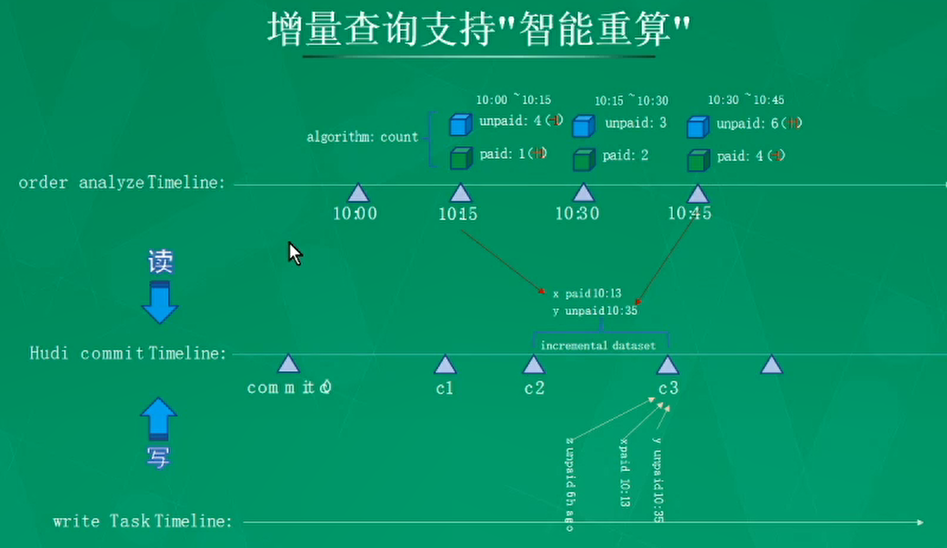

痛点；
- 数据采集的PipeLine无法保证可靠性
- 分布式数据PipeLine中丢数据无法对账

总结：
- 性能
    - Hudi与Flink框架集成，提供更低延迟的流式数据写入，绑定检查点增强容错
    - Alluxio加速Hudi on OSS，性能平均提升近10倍
- 功能
    - Hudi跟Spark解耦，为业务端使用java/python访问数据湖提供基础
    - Hudi跟海豚调度框架集成，支撑更高效的增量处理能力
    - Hudi write Commit集成Kafka，实现异步消息通知机制
    - Hudi集成Zeepelin，释放Ad-Hoc的查询、分析能力
- 进行中
    - Hudi与Kylin集成释放数据湖上OLAP的能力
    - Hudi存取非结构化数据

### 基于Iceberg打造新一代数据湖
Iceberg的核心思想：在时间轴上跟踪表的所有变化
- 每次更新操作会生成一个新的快照

重要特性
- 优化数据入库流程
- 支持更多的分析引擎
- 统一数据存储和灵活的文件组织
- 增量读取处理能力

实现细节
- 快速设计方式
    - 快照隔离
        - 读操作仅适用于当前已生成快照
        - 写操作会生成新的隔离快照，并在写完成后原子性提交
    - 对于文件列表的所有修改都是原子操作
        - 在分区中追加数据
        - 合并或是重写分区
- 元数据组织方式
    - 实现基于快照的跟踪方式
        - 记录表的结构，分区信息，参数等
        - 跟踪老的快照以确保能够最终回收
    - 表的元数据是不可修改的，并且始终向前迭代
    - 当前的快照可以回退
- 事务性提交
    - 写操作必须
        - 记录当前元数据的版本 --base version
        - 创建新的元数据文件以及manifest文件
        - 原子性的将base version替换为新的版本
    - 原子性替换保证了线性的历史
    - 原子性提供需要依靠一下操作来保证
        - 元数据管理器所提供的能力
        - HDFS或本地文件系统所提供的原子化的rename能力
    - 冲突解决——乐观锁
        - 假定当前没有其他的写操作
        - 遇到冲突则基于当前最新的元数据进行重试

结合Flink场景

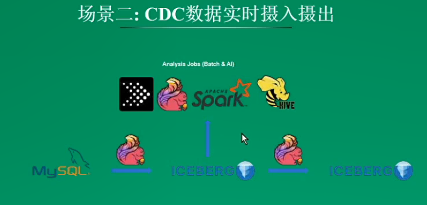

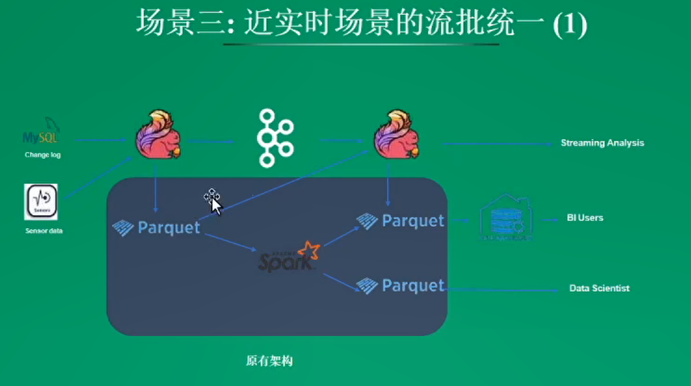
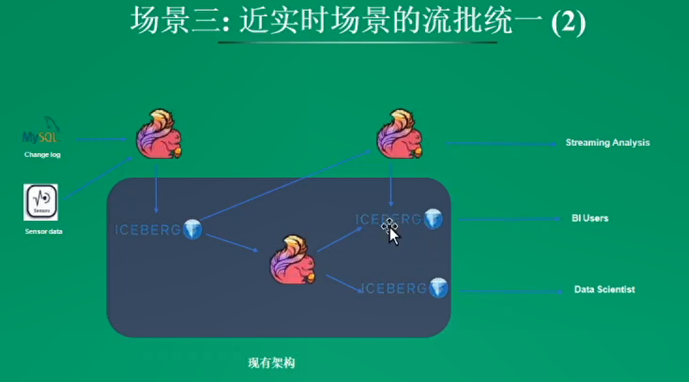

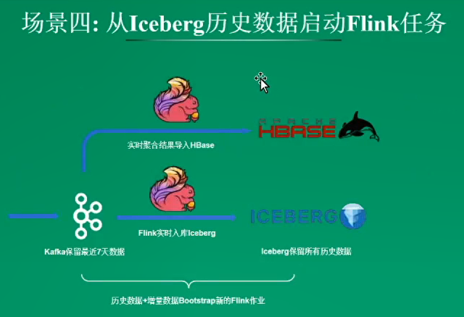

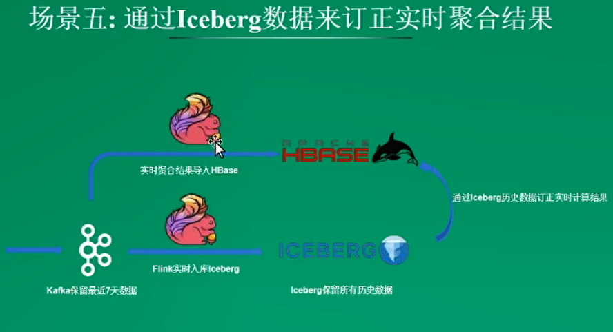

Flink如何集成Iceberg

基于Iceberg构建数据湖分析系统
- 原有架构

- 改造方案
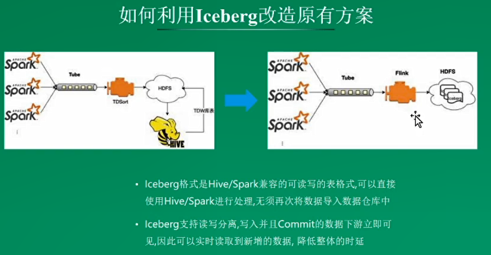

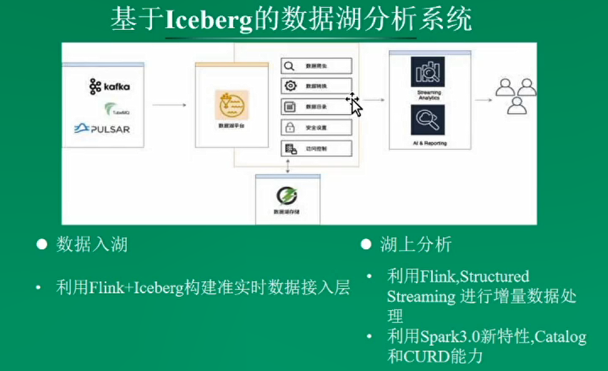

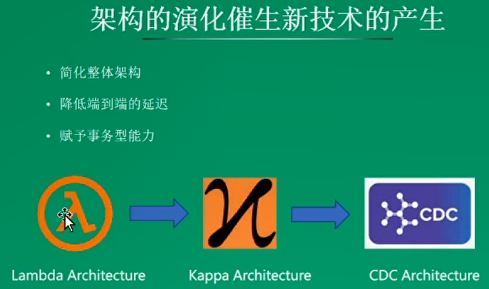
