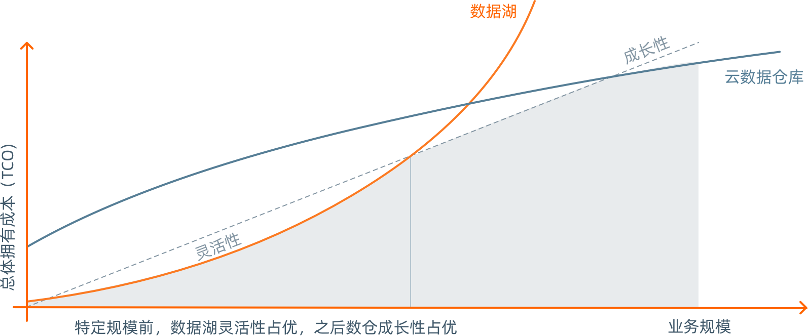
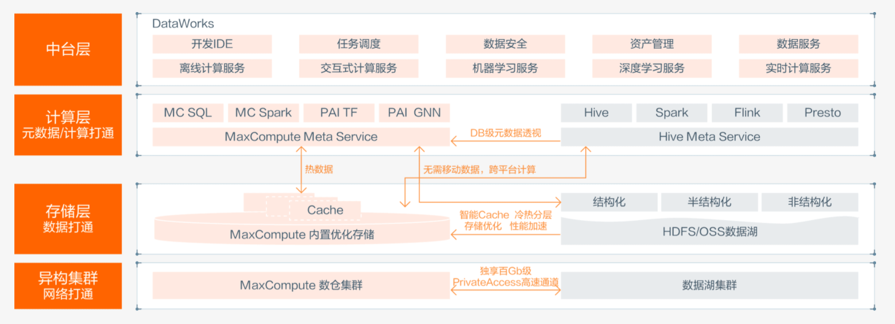
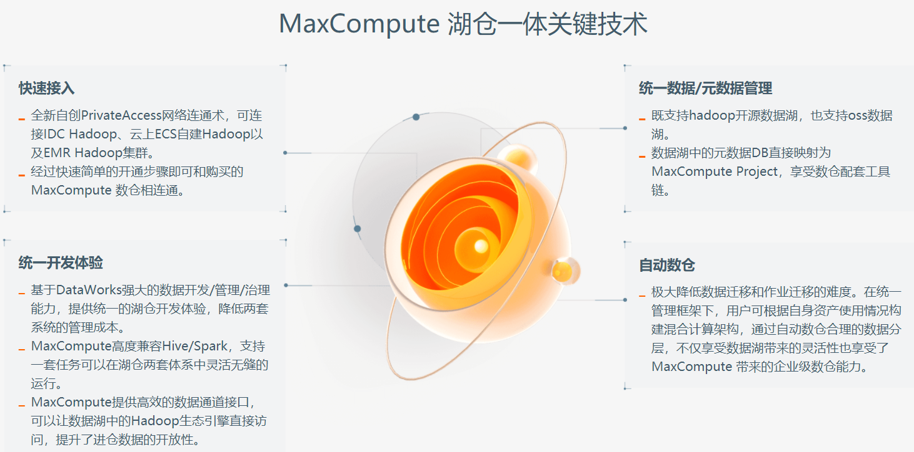

## 湖仓一体Lakehouse

### 数据仓库VS数据湖
- 数据仓库
  - 数据体系严格，提前建模 
  - 灵活性较低 
  - 数据治理容易 
  - 数据种类单一（结构化、半结构化） 
  - 面向成熟数据的企业级分析与处理 
  - 向特定引擎开放，易获得高度优化

- 数据湖
  - 数据体系松散，事后建模 
  - 灵活性较高 
  - 数据治理困难 
  - 数据种类丰富（结构化、半结构化、非结构化） 
  - 面向异构数据的科学探查与价值挖掘 
  - 向所有引擎开放，各引擎有限优化

如何才能同时享受数据湖的灵活性和云数据仓库的成长性？
> 湖仓一体:兼具数据湖的灵活性与,数据仓库的成长性

技术架构

关键技术
