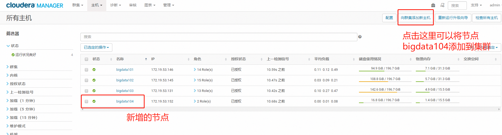

## 新增节点

采取离线安装的方式。

- 1.新机器准备：
    - 创建用户，加sudo权限
    - 改hostname
    - 修改/etc/hosts
    - 关闭防火墙
    - 装必要的三方包
    - 安装JDK。从其他机器
- 2.把cm的安装包传到 /opt 目录下
- 3.解压
```
cd /opt
tar -zxvf cloudera-manager-centos7-cm5.13.3_x86_64.tar.gz
# 解压后会有 cm-5.13.3 和 cloudera 两个目录
```
- 4.配置cloudera-agent
```
vim /opt/cm-5.13.3/etc/cloudera-scm-agent/config.ini

# 修改 server_host=bigdata101
```
- 5.创建cloudera-scm用户
```
useradd --system --home=/opt/cm-5.13.3/run/cloudera-scm-server --no-create-home --shell=/bin/false --comment "Cloudera SCM User" cloudera-scm
```
- 6.启动cloudera-scm-agent
```
/opt/cm-5.13.3/etc/init.d/cloudera-scm-agent
```
- 7.登录cloudera manager的管理界面。选择："主机-所有主机"即可看到新增加的节点bigdata104



- 8.接下来的步骤与初始安装CDH集群的时候类型。（发放parcel包并激活）
- 9.注意在“选择主机模板”的时候，可以新建一个模板，并且把要用的DataNode以及NodeManager添加进去。如果没有操作，就需要手动去添加角色实例